# 《实验二：索引&文档操作》

学院：省级示范性软件学院

题目：《实验二：索引操作与文档操作练习》

姓名：陆金淼

学号：2200770279

班级：软工2203

日期：2024-09-20

实验环境：Elasticsearch8.12.2 Kibana8.12.2

## 一、实验目的

1. 掌握Elasticsearch 安装IK分词器安装方法
2. 掌握Elasticsearch 索引操作方法
3. 掌握Elasticsearch 文档操作训练
4. 掌握Elasticsearch 高级查询与DSL训练

## 二、实验内容

### 1.Elasticsearch 安装IK分词器

安装与elasticsearch-8.12.2相匹配的ik分词器elasticsearch-analysis-ik-8.12.2，安装成功之后可以在elasticsearch-8.12.2目录下的config目录查看。

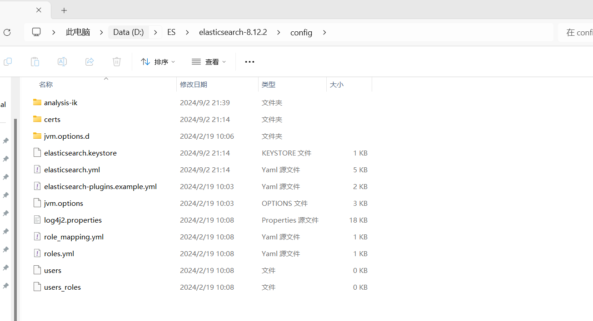

### 2.Elasticsearch 索引操作训练（附要求和代码）

**要求：能够根据字段描述，创建索引，修改索引，删除索引**

**任务一：**

1. **创建索引**
2. **修改索引**(自己设计，修改要合理）
3. **删除索引**
4. **查看所有**

#### 2.1.用户信息 (User Information) 索引

题目要求如下：

1. **user\_id**:

* **类型**:`keyword`
* **描述**: 用户的唯一标识符，通常是一个不变的字符串。用于快速查找和过滤用户。

2. **name**:

* **类型**: `text`
* **描述**: 用户的姓名。使用标准分析器处理以支持全文搜索。

3. **email**:

* **类型**: `keyword`
* **描述**: 用户的电子邮件地址。作为关键词存储以确保精确匹配，便于查找。

4. **date\_of\_birth**:

* **类型**: `date`
* **描述**: 用户的出生日期，格式为日期类型，便于进行年龄计算和范围查询。

5. **gender**:

* **类型**: `keyword`
* **描述**: 用户的性别信息，通常为固定值（如“male”、“female”），用于过滤和统计分析。

6. **address**:

* **类型**: `text`
* **描述**: 用户的居住地址。支持全文搜索以便于地址相关查询。

7. **phone\_number**:

* **类型**: `keyword`
* **描述**: 用户的电话号码，作为关键词存储以确保精确匹配。

8. **registration\_date**:

* **类型**:`date`
* **描述****: 用户注册账户的日期，用于时间序列分析和统计。

9. **last\_login**:

* **类型**: `date`
* **描述**: 用户最后一次登录的日期和时间，便于跟踪用户活动。

10. **status**:

* **类型**: `keyword`
* **描述**: 用户账户的当前状态（如“active”、“inactive”），用于筛选和状态管理。

代码如下：

1.创建索引`user_information`

```
PUT /user_information
{
  "mappings": {
    "properties": {
      "user_id": {
        "type": "keyword"
      },
      "name": {
        "type": "text",
        "analyzer": "standard"
      },
      "email": {
        "type": "keyword"
      },
      "date_of_birth": {
        "type": "date"
      },
      "gender": {
        "type": "keyword"
      },
      "address": {
        "type": "text",
        "analyzer": "standard"
      },
      "phone_number": {
        "type": "keyword"
      },
      "registration_date": {
        "type": "date"
      },
      "last_login": {
        "type": "date"
      },
      "status": {
        "type": "keyword"
      }
    }
  }
}
```

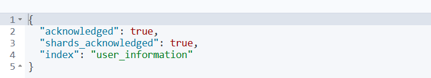

2.修改索引

添加一个 `description` 字段

```
PUT /user_information/_mapping
{
  "properties": {
    "description": {
      "type": "keyword",
      "null_value": "NULL"
    }
  }
}

```


3.查看索引

使用`GET /user_information`查看所有

运行结果：

```
{
  "user_information": {
    "aliases": {},
    "mappings": {
      "properties": {
        "address": {
          "type": "text",
          "analyzer": "standard"
        },
        "date_of_birth": {
          "type": "date"
        },
        "description": {
          "type": "keyword",
          "null_value": "NULL"
        },
        "email": {
          "type": "keyword"
        },
        "gender": {
          "type": "keyword"
        },
        "last_login": {
          "type": "date"
        },
        "name": {
          "type": "text",
          "analyzer": "standard"
        },
        "phone_number": {
          "type": "keyword"
        },
        "registration_date": {
          "type": "date"
        },
        "status": {
          "type": "keyword"
        },
        "user_id": {
          "type": "keyword"
        }
      }
    },
    "settings": {
      "index": {
        "routing": {
          "allocation": {
            "include": {
              "_tier_preference": "data_content"
            }
          }
        },
        "number_of_shards": "1",
        "provided_name": "user_information",
        "creation_date": "1726837914313",
        "number_of_replicas": "1",
        "uuid": "TQCvygF1QH62QbJV76sjJQ",
        "version": {
          "created": "8500010"
        }
      }
    }
  }
}
```

4.删除索引

使用`DELETE /user_information`删除索引

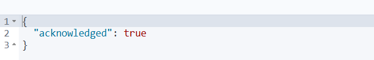

#### 2.2.产品目录(Product Catalog) 索引

题目要求如下：

1. **product\_id**:

* **类型**: `keyword`
* **描述**: 产品的唯一标识符，通常是一个不变的字符串。用于快速查找和过滤特定产品。

2. **name**:

* **类型**: `text`
* **描述**: 产品的名称。使用标准分析器处理以支持全文搜索和匹配。

3. **description**:

* **类型**: `text`
* **描述**: 产品的详细描述。支持全文搜索，使用户能够通过关键词查找产品。

4. **category**:

* **类型**: `keyword`
* **描述**: 产品所属的类别，用于分类和过滤产品。

5. **price**:

* **类型**: `double`
* **描述**: 产品的价格，以浮点数表示，便于进行价格范围查询和排序。

6. **stock\_quantity**:

* **类型**:`integer`
* **描述**: 产品的库存数量，以整数表示，用于库存管理和查询。

7. **supplier**:

* **类型**:`keyword`
* **描述**: 产品的供应商信息，通常是供应商的名称或ID，用于追踪和管理供应链。

8. **release\_date**:

* **类型**: `date`
* **描述**: 产品的发布日期，便于进行时间序列分析和新产品的筛选。

9. **tags**:

* **类型**: `keyword`
* **描述**: 与产品相关的标签，用于搜索和过滤产品。

10. **rating**:

* **类型**:`float`
* **描述**: 产品的平均评分，以浮点数表示，用于排序和筛选高评分产品。

代码如下：

1.创建索引`product_catalog`

```
PUT /product_catalog
{
  "mappings": {
    "properties": {
      "product_id": {
        "type": "keyword"
      },
      "name": {
        "type": "text",
        "analyzer": "standard"
      },
      "description": {
        "type": "text",
        "analyzer": "standard"
      },
      "category": {
        "type": "keyword"
      },
      "price": {
        "type": "double"
      },
      "stock_quantity": {
        "type": "integer"
      },
      "supplier": {
        "type": "keyword"
      },
      "release_date": {
        "type": "date"
      },
      "tags": {
        "type": "keyword"
      },
      "rating": {
        "type": "float"
      }
    }
  }
}
```

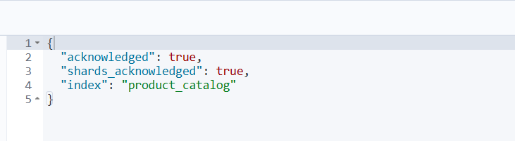

2.修改索引

添加一个 `new_filed` 字段

```
PUT /user_information/_mapping
{
  "properties": {
    "description": {
      "type": "keyword",
      "null_value": "NULL"
    }
  }
}
```

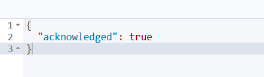

3.查看索引

使用`GET /product_catalog`查看所有

运行结果：

```
{
  "product_catalog": {
    "aliases": {},
    "mappings": {
      "properties": {
        "category": {
          "type": "keyword"
        },
        "description": {
          "type": "text",
          "analyzer": "standard"
        },
        "name": {
          "type": "text",
          "analyzer": "standard"
        },
        "new_field": {
          "type": "text"
        },
        "price": {
          "type": "double"
        },
        "product_id": {
          "type": "keyword"
        },
        "rating": {
          "type": "float"
        },
        "release_date": {
          "type": "date"
        },
        "stock_quantity": {
          "type": "integer"
        },
        "supplier": {
          "type": "keyword"
        },
        "tags": {
          "type": "keyword"
        }
      }
    },
    "settings": {
      "index": {
        "routing": {
          "allocation": {
            "include": {
              "_tier_preference": "data_content"
            }
          }
        },
        "number_of_shards": "1",
        "provided_name": "product_catalog",
        "creation_date": "1726837551303",
        "number_of_replicas": "1",
        "uuid": "SuWEcHTkQJmdY47Sn0l2Dg",
        "version": {
          "created": "8500010"
        }
      }
    }
  }
}
```

4.删除索引

使用`DELETE /product_catalog`删除索引


#### 2.3. 订单记录 (Order Records) 索引字段描述

题目要求如下：

1. **order\_id**:

* **类型**: `keyword`
* **描述**: 订单的唯一标识符，用于快速查找和管理订单。

2. **customer\_id**:

* **类型**: `keyword`
* **描述**: 客户的唯一标识符，关联到用户信息，便于查询特定客户的订单记录。

3. **order\_date**:

* **类型**:`date`
* **描述**: 订单创建的日期和时间，用于时间序列分析和订单管理。

4. **status**:

* **类型**: `keyword`
* **描述**: 订单的当前状态（如“pending”、“shipped”、“completed”），用于筛选和管理订单。

5. **total\_amount**:

* **类型**:`double`
* **描述**: 订单的总金额，以浮点数表示，用于财务分析和报告。

6. **items**:

* **类型**: `nested`
* **描述**: 订单中包含的商品列表，每个商品包含以下字段：
  * **product\_id**: `keyword` **- 商品的唯一标识符。**
  * **quantity**: `integer` **- 购买的商品数量。**
  * **price**:`double` **- 商品的单价。**

7. **shipping\_address**:

* **类型**:`text`
* **描述**: 订单的送货地址，支持全文搜索以便于地址相关查询。

8. **payment\_method**:

* **类型**:`keyword`
* **描述**: 使用的支付方式（如“credit card”、“paypal”），用于支付方式分析和报告。

9. **shipping\_date**:

* **类型**: `date`
* **描述**: 订单发货的日期，便于物流跟踪和管理。

10. **delivery\_date**:

* **类型**: `date`
* **描述**: 订单预计或实际送达的日期，用于客户服务和物流优化。

代码如下：

1.创建索引order_records

```
PUT /order_records
{
  "mappings": {
    "properties": {
      "order_id": {
        "type": "keyword"
      },
      "customer_id": {
        "type": "keyword"
      },
      "order_date": {
        "type": "date"
      },
      "status": {
        "type": "keyword"
      },
      "total_amount": {
        "type": "double"
      },
      "items": {
        "type": "nested",
        "properties": {
          "product_id": {
            "type": "keyword"
          },
          "quantity": {
            "type": "integer"
          },
          "price": {
            "type": "double"
          }
        }
      },
      "shipping_address": {
        "type": "text",
        "analyzer": "standard"
      },
      "payment_method": {
        "type": "keyword"
      },
      "shipping_date": {
        "type": "date"
      },
      "delivery_date": {
        "type": "date"
      }
    }
  }
}
```

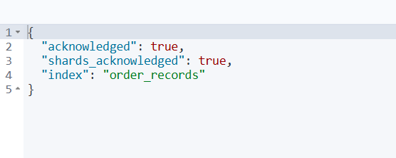

2.修改索引

添加一个 `tracking_number` 字段

```
PUT /order_records/_mapping
{
  "properties": {
    "tracking_number": { "type": "keyword" }
  }
}

```


3.查看索引

使用`GET /order_records`查看所有

运行结果：

```
{
  "order_records": {
    "aliases": {},
    "mappings": {
      "properties": {
        "customer_id": {
          "type": "keyword"
        },
        "delivery_date": {
          "type": "date"
        },
        "items": {
          "type": "nested",
          "properties": {
            "price": {
              "type": "double"
            },
            "product_id": {
              "type": "keyword"
            },
            "quantity": {
              "type": "integer"
            }
          }
        },
        "order_date": {
          "type": "date"
        },
        "order_id": {
          "type": "keyword"
        },
        "payment_method": {
          "type": "keyword"
        },
        "shipping_address": {
          "type": "text",
          "analyzer": "standard"
        },
        "shipping_date": {
          "type": "date"
        },
        "status": {
          "type": "keyword"
        },
        "total_amount": {
          "type": "double"
        },
        "tracking_number": {
          "type": "keyword"
        }
      }
    },
    "settings": {
      "index": {
        "routing": {
          "allocation": {
            "include": {
              "_tier_preference": "data_content"
            }
          }
        },
        "number_of_shards": "1",
        "provided_name": "order_records",
        "creation_date": "1726838320031",
        "number_of_replicas": "1",
        "uuid": "OS67eOUmQcGi1qYJcPprfQ",
        "version": {
          "created": "8500010"
        }
      }
    }
  }
}
```

4.删除索引

使用`DELETE /order_records`删除索引


### 3.Elasticsearch 文档操作训练

**要求：文档的CRUD练习**

**任务二：**

1. **创建文档**
2. **修改文档(自己设计，修改要合理）**
3. **删除文档**
4. **查看文档**
5. **将下面的Json数据批量导入ES数据库中**

#### 3.1用户信息数据

1.创建文档

在`user_information` 索引下创建文档

代码如下：

```
POST /user_information/_doc/1
{
  "user_id": "001",
  "name": "John Doe",
  "email": "john.doe@example.com",
  "date_of_birth": "1990-05-15",
  "gender": "male",
  "address": "123 Elm Street, Anytown, USA",
  "phone_number": "123-456-7890",
  "registration_date": "2023-01-01",
  "last_login": "2024-09-20",
  "status": "active"
}
```

运行结果：

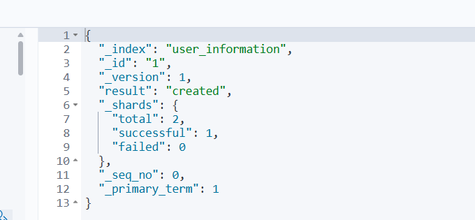

2.修改文档

修改`user_information`下创建的文档内容

代码如下：

```
POST /user_information/_update/1
{
  "doc": {
    "name": "John D. Doe",
    "last_login": "2024-09-21"
  }
}
```

运行结果：

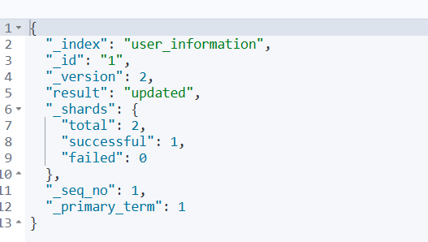

3.查看文档

使用`GET /user_information/_doc/1`查看文档

运行结果：

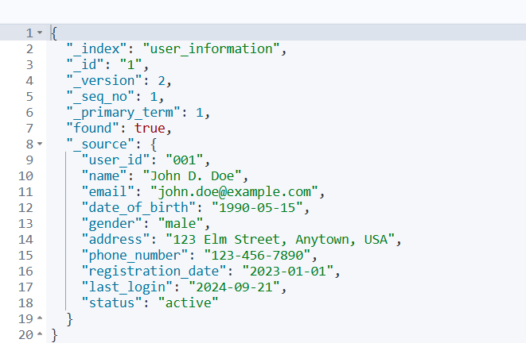

4.删除文档

使用`DELETE /user_information/_doc/1`删除文档

运行结果：

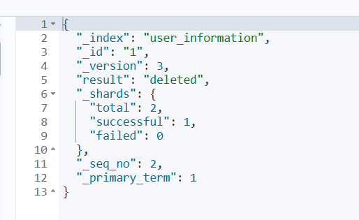

5.批量插入数据

代码如下：

```
POST /user_information/_bulk
{"index":{"_id":"001"}}
{"user_id":"001","name":"Alice Johnson","email":"alice.johnson@example.com","date_of_birth":"1990-05-15","gender":"female","address":"123 Main St, Anytown, USA","phone_number":"123-456-7890","registration_date":"2023-01-15","last_login":"2024-09-01","status":"active"}
{"index":{"_id":"002"}}
{"user_id":"002","name":"Bob Smith","email":"bob.smith@example.com","date_of_birth":"1985-08-20","gender":"male","address":"456 Elm St, Othertown, USA","phone_number":"234-567-8901","registration_date":"2023-02-20","last_login":"2024-08-25","status":"active"}
{"index":{"_id":"003"}}
{"user_id":"003","name":"Charlie Brown","email":"charlie.brown@example.com","date_of_birth":"1992-11-30","gender":"male","address":"789 Maple Ave, Sometown, USA","phone_number":"345-678-9012","registration_date":"2023-03-10","last_login":"2024-09-05","status":"inactive"}
{"index":{"_id":"004"}}
{"user_id":"004","name":"David Wilson","email":"david.wilson@example.com","date_of_birth":"1988-02-14","gender":"male","address":"101 Oak St, Anycity, USA","phone_number":"456-789-0123","registration_date":"2023-04-05","last_login":"2024-08-30","status":"active"}
{"index":{"_id":"005"}}
{"user_id":"005","name":"Eve Davis","email":"eve.davis@example.com","date_of_birth":"1995-07-22","gender":"female","address":"202 Pine St, Otherville, USA","phone_number":"567-890-1234","registration_date":"2023-05-18","last_login":"2024-09-02","status":"active"}
{"index":{"_id":"006"}}
{"user_id":"006","name":"Frank Miller","email":"frank.miller@example.com","date_of_birth":"1991-10-05","gender":"male","address":"303 Cedar Rd, Newtown, USA","phone_number":"678-901-2345","registration_date":"2023-06-22","last_login":"2024-09-03","status":"active"}
{"index":{"_id":"007"}}
{"user_id":"007","name":"Grace Lee","email":"grace.lee@example.com","date_of_birth":"1989-04-17","gender":"female","address":"404 Birch Ln, Oldtown, USA","phone_number":"789-012-3456","registration_date":"2023-07-30","last_login":"2024-09-04","status":"inactive"}
{"index":{"_id":"008"}}
{"user_id":"008","name":"Hannah White","email":"hannah.white@example.com","date_of_birth":"1993-12-25","gender":"female","address":"505 Spruce St, Littletown, USA","phone_number":"890-123-4567","registration_date":"2023-08-15","last_login":"2024-09-06","status":"active"}
{"index":{"_id":"009"}}
{"user_id":"009","name":"Ivy Green","email":"ivy.green@example.com","date_of_birth":"1994-03-03","gender":"female","address":"606 Willow Ave, Bigcity, USA","phone_number":"901-234-5678","registration_date":"2023-09-01","last_login":"2024-09-07","status":"active"}
{"index":{"_id":"010"}}
{"user_id":"010","name":"Jack Black","email":"jack.black@example.com","date_of_birth":"1987-06-18","gender":"male","address":"707 Poplar Dr, Smalltown, USA","phone_number":"012-345-6789","registration_date":"2023-10-10","last_login":"2024-09-08","status":"inactive"}
{"index":{"_id":"011"}}
{"user_id":"011","name":"Karen Adams","email":"karen.adams@example.com","date_of_birth":"1990-09-21","gender":"female","address":"808 Chestnut Blvd, Metropolis, USA","phone_number":"123-456-7890","registration_date":"2023-11-25","last_login":"2024-09-09","status":"active"}
{"index":{"_id":"012"}}
{"user_id":"012","name":"Leo King","email":"leo.king@example.com","date_of_birth":"1986-01-12","gender":"male","address":"909 Ash Ct, Villagetown, USA","phone_number":"234-567-8901","registration_date":"2023-12-05","last_login":"2024-09-10","status":"active"}
{"index":{"_id":"013"}}
{"user_id":"013","name":"Mia Moore","email":"mia.moore@example.com","date_of_birth":"1992-02-28","gender":"female","address":"1010 Fir Ln, Hamlet, USA","phone_number":"345-678-9012","registration_date":"2024-01-10","last_login":"2024-09-11","status":"inactive"}
{"index":{"_id":"014"}}
{"user_id":"014","name":"Nina Scott","email":"nina.scott@example.com","date_of_birth":"1988-05-05","gender":"female","address":"1111 Cypress St, Township, USA","phone_number":"456-789-0123","registration_date":"2024-02-14","last_login":"2024-09-12","status":"active"}
{"index":{"_id":"015"}}
{"user_id":"015","name":"Oscar Turner","email":"oscar.turner@example.com","date_of_birth":"1991-07-19","gender":"male","address":"1212 Redwood Rd, Cityville, USA","phone_number":"567-890-1234","registration_date":"2024-03-20","last_login":"2024-09-13","status":"active"}
{"index":{"_id":"016"}}
{"user_id":"016","name":"Paul Walker","email":"paul.walker@example.com","date_of_birth":"1989-10-10","gender":"male","address":"1313 Cherry Ave, Urbantown, USA","phone_number":"678-901-2345","registration_date":"2024-04-25","last_login":"2024-09-14","status":"inactive"}
{"index":{"_id":"017"}}
{"user_id":"017","name":"Quinn Hughes","email":"quinn.hughes@example.com","date_of_birth":"1993-11-11","gender":"male","address":"1414 Beech St, Suburbia, USA","phone_number":"789-012-3456","registration_date":"2024-05-30","last_login":"2024-09-15","status":"active"}
{"index":{"_id":"018"}}
{"user_id":"018","name":"Rose Hall","email":"rose.hall@example.com","date_of_birth":"1990-03-22","gender":"female","address":"1515 Palm Dr, Downtown, USA","phone_number":"890-123-4567","registration_date":"2024-06-15","last_login":"2024-09-16","status":"active"}
{"index":{"_id":"019"}}
{"user_id":"019","name":"Steve Young","email":"steve.young@example.com","date_of_birth":"1987-09-09","gender":"male","address":"1616 Pine St, Uptown, USA","phone_number":"901-234-5678","registration_date":"2024-07-20","last_login":"2024-09-17","status":"inactive"}
{"index":{"_id":"020"}}
{"user_id":"020","name":"Tina Brown","email":"tina.brown@example.com","date_of_birth":"1994-12-12","gender":"female","address":"1717 Maple Ave, Seaside, USA","phone_number":"012-345-6789","registration_date":"2024-08-10","last_login":"2024-09-18","status":"active"}
```

运行结果：

```
{
  "errors": false,
  "took": 33,
  "items": [
    {
      "index": {
        "_index": "user_information",
        "_id": "001",
        "_version": 1,
        "result": "created",
        "_shards": {
          "total": 2,
          "successful": 1,
          "failed": 0
        },
        "_seq_no": 0,
        "_primary_term": 1,
        "status": 201
      }
    },
    {
      "index": {
        "_index": "user_information",
        "_id": "002",
        "_version": 1,
        "result": "created",
        "_shards": {
          "total": 2,
          "successful": 1,
          "failed": 0
        },
        "_seq_no": 1,
        "_primary_term": 1,
        "status": 201
      }
    },
    {
      "index": {
        "_index": "user_information",
        "_id": "003",
        "_version": 1,
        "result": "created",
        "_shards": {
          "total": 2,
          "successful": 1,
          "failed": 0
        },
        "_seq_no": 2,
        "_primary_term": 1,
        "status": 201
      }
    },
    {
      "index": {
        "_index": "user_information",
        "_id": "004",
        "_version": 1,
        "result": "created",
        "_shards": {
          "total": 2,
          "successful": 1,
          "failed": 0
        },
        "_seq_no": 3,
        "_primary_term": 1,
        "status": 201
      }
    },
    {
      "index": {
        "_index": "user_information",
        "_id": "005",
        "_version": 1,
        "result": "created",
        "_shards": {
          "total": 2,
          "successful": 1,
          "failed": 0
        },
        "_seq_no": 4,
        "_primary_term": 1,
        "status": 201
      }
    },
    {
      "index": {
        "_index": "user_information",
        "_id": "006",
        "_version": 1,
        "result": "created",
        "_shards": {
          "total": 2,
          "successful": 1,
          "failed": 0
        },
        "_seq_no": 5,
        "_primary_term": 1,
        "status": 201
      }
    },
    {
      "index": {
        "_index": "user_information",
        "_id": "007",
        "_version": 1,
        "result": "created",
        "_shards": {
          "total": 2,
          "successful": 1,
          "failed": 0
        },
        "_seq_no": 6,
        "_primary_term": 1,
        "status": 201
      }
    },
    {
      "index": {
        "_index": "user_information",
        "_id": "008",
        "_version": 1,
        "result": "created",
        "_shards": {
          "total": 2,
          "successful": 1,
          "failed": 0
        },
        "_seq_no": 7,
        "_primary_term": 1,
        "status": 201
      }
    },
    {
      "index": {
        "_index": "user_information",
        "_id": "009",
        "_version": 1,
        "result": "created",
        "_shards": {
          "total": 2,
          "successful": 1,
          "failed": 0
        },
        "_seq_no": 8,
        "_primary_term": 1,
        "status": 201
      }
    },
    {
      "index": {
        "_index": "user_information",
        "_id": "010",
        "_version": 1,
        "result": "created",
        "_shards": {
          "total": 2,
          "successful": 1,
          "failed": 0
        },
        "_seq_no": 9,
        "_primary_term": 1,
        "status": 201
      }
    },
    {
      "index": {
        "_index": "user_information",
        "_id": "011",
        "_version": 1,
        "result": "created",
        "_shards": {
          "total": 2,
          "successful": 1,
          "failed": 0
        },
        "_seq_no": 10,
        "_primary_term": 1,
        "status": 201
      }
    },
    {
      "index": {
        "_index": "user_information",
        "_id": "012",
        "_version": 1,
        "result": "created",
        "_shards": {
          "total": 2,
          "successful": 1,
          "failed": 0
        },
        "_seq_no": 11,
        "_primary_term": 1,
        "status": 201
      }
    },
    {
      "index": {
        "_index": "user_information",
        "_id": "013",
        "_version": 1,
        "result": "created",
        "_shards": {
          "total": 2,
          "successful": 1,
          "failed": 0
        },
        "_seq_no": 12,
        "_primary_term": 1,
        "status": 201
      }
    },
    {
      "index": {
        "_index": "user_information",
        "_id": "014",
        "_version": 1,
        "result": "created",
        "_shards": {
          "total": 2,
          "successful": 1,
          "failed": 0
        },
        "_seq_no": 13,
        "_primary_term": 1,
        "status": 201
      }
    },
    {
      "index": {
        "_index": "user_information",
        "_id": "015",
        "_version": 1,
        "result": "created",
        "_shards": {
          "total": 2,
          "successful": 1,
          "failed": 0
        },
        "_seq_no": 14,
        "_primary_term": 1,
        "status": 201
      }
    },
    {
      "index": {
        "_index": "user_information",
        "_id": "016",
        "_version": 1,
        "result": "created",
        "_shards": {
          "total": 2,
          "successful": 1,
          "failed": 0
        },
        "_seq_no": 15,
        "_primary_term": 1,
        "status": 201
      }
    },
    {
      "index": {
        "_index": "user_information",
        "_id": "017",
        "_version": 1,
        "result": "created",
        "_shards": {
          "total": 2,
          "successful": 1,
          "failed": 0
        },
        "_seq_no": 16,
        "_primary_term": 1,
        "status": 201
      }
    },
    {
      "index": {
        "_index": "user_information",
        "_id": "018",
        "_version": 1,
        "result": "created",
        "_shards": {
          "total": 2,
          "successful": 1,
          "failed": 0
        },
        "_seq_no": 17,
        "_primary_term": 1,
        "status": 201
      }
    },
    {
      "index": {
        "_index": "user_information",
        "_id": "019",
        "_version": 1,
        "result": "created",
        "_shards": {
          "total": 2,
          "successful": 1,
          "failed": 0
        },
        "_seq_no": 18,
        "_primary_term": 1,
        "status": 201
      }
    },
    {
      "index": {
        "_index": "user_information",
        "_id": "020",
        "_version": 1,
        "result": "created",
        "_shards": {
          "total": 2,
          "successful": 1,
          "failed": 0
        },
        "_seq_no": 19,
        "_primary_term": 1,
        "status": 201
      }
    }
  ]
}
```

#### 3.2产品目录数据

1.创建文档

在`product_catalog`索引下创建文档

代码如下：

```
POST /product_catalog/_doc/1
{
  "product_id": "P001",
  "name": "Gaming Mouse",
  "description": "High precision gaming mouse with customizable buttons.",
  "category": "Electronics",
  "price": 29.99,
  "stock_quantity": 100,
  "supplier": "TechSupplies",
  "release_date": "2022-06-01",
  "tags": ["gaming", "electronics"],
  "rating": 4.5
}
```

运行结果：

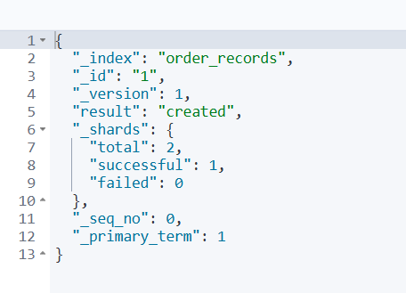

2.修改文档

修改`product_catalog`下创建的文档内容

代码如下:

```
POST /product_catalog/_update/1
{
  "doc": {
    "price": 34.99,
    "stock_quantity": 150
  }
}
```

运行结果：

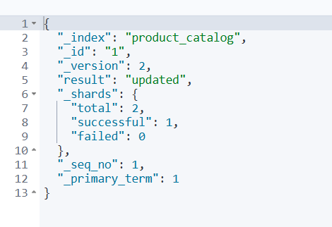

3.查看文档

使用`GET /product_catalog/_doc/1`查看文档

运行结果：

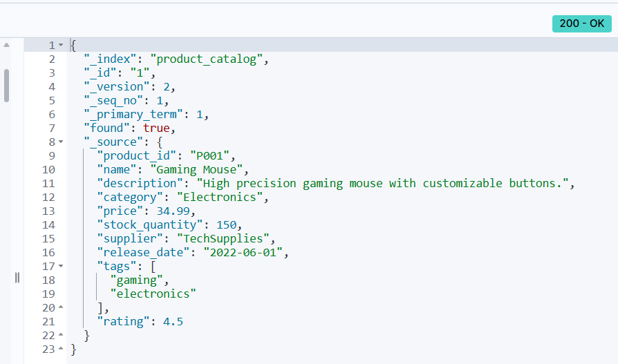

4.删除文档

使用`DELETE /product_catalog/_doc/1`删除文档

运行结果：

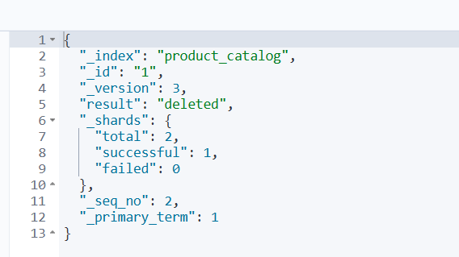

5.批量插入数据

代码如下：

```
POST /product_catalog/_bulk
{"index":{"_id":"001"}}
{"product_id":"P001","name":"Wireless Mouse","description":"A high precision wireless mouse with ergonomic design.","category":"Electronics","price":29.99,"stock_quantity":150,"supplier":"TechCorp","release_date":"2023-01-15","tags":["wireless","mouse","electronics"],"rating":4.5}
{"index":{"_id":"002"}}
{"product_id":"P002","name":"Bluetooth Speaker","description":"Portable Bluetooth speaker with excellent sound quality.","category":"Audio","price":49.99,"stock_quantity":200,"supplier":"SoundWave","release_date":"2023-02-20","tags":["bluetooth","speaker","audio"],"rating":4.7}
{"index":{"_id":"003"}}
{"product_id":"P003","name":"Smartphone Stand","description":"Adjustable smartphone stand for hands-free viewing.","category":"Accessories","price":15.99,"stock_quantity":300,"supplier":"GadgetPlus","release_date":"2023-03-10","tags":["smartphone","stand","accessories"],"rating":4.3}
{"index":{"_id":"004"}}
{"product_id":"P004","name":"USB-C Charger","description":"Fast charging USB-C charger compatible with most devices.","category":"Chargers","price":19.99,"stock_quantity":250,"supplier":"ChargeMaster","release_date":"2023-04-05","tags":["usb-c","charger","electronics"],"rating":4.6}
{"index":{"_id":"005"}}
{"product_id":"P005","name":"Noise Cancelling Headphones","description":"Over-ear headphones with active noise cancellation.","category":"Audio","price":89.99,"stock_quantity":100,"supplier":"AudioTech","release_date":"2023-05-18","tags":["noise cancelling","headphones","audio"],"rating":4.8}
{"index":{"_id":"006"}}
{"product_id":"P006","name":"4K Monitor","description":"Ultra HD 4K monitor with stunning display quality.","category":"Monitors","price":299.99,"stock_quantity":80,"supplier":"ViewPerfect","release_date":"2023-06-22","tags":["4k","monitor","electronics"],"rating":4.9}
{"index":{"_id":"007"}}
{"product_id":"P007","name":"Gaming Keyboard","description":"Mechanical keyboard with customizable RGB lighting.","category":"Gaming","price":59.99,"stock_quantity":120,"supplier":"GameGear","release_date":"2023-07-30","tags":["gaming","keyboard","electronics"],"rating":4.4}
{"index":{"_id":"008"}}
{"product_id":"P008","name":"Fitness Tracker","description":"Smart fitness tracker with heart rate monitor.","category":"Wearables","price":39.99,"stock_quantity":180,"supplier":"FitLife","release_date":"2023-08-15","tags":["fitness","tracker","wearables"],"rating":4.2}
{"index":{"_id":"009"}}
{"product_id":"P009","name":"Electric Toothbrush","description":"Rechargeable electric toothbrush with multiple modes.","category":"Personal Care","price":34.99,"stock_quantity":140,"supplier":"SmileBright","release_date":"2023-09-01","tags":["electric","toothbrush","personal care"],"rating":4.5}
{"index":{"_id":"010"}}
{"product_id":"P010","name":"Smart Thermostat","description":"Wi-Fi enabled smart thermostat with energy saving features.","category":"Home Automation","price":129.99,"stock_quantity":90,"supplier":"HomeSmart","release_date":"2023-10-10","tags":["smart","thermostat","home automation"],"rating":4.7}
{"index":{"_id":"011"}}
{"product_id":"P011","name":"LED Desk Lamp","description":"Adjustable LED desk lamp with touch control.","category":"Lighting","price":24.99,"stock_quantity":160,"supplier":"BrightLight","release_date":"2023-11-25","tags":["led","desk lamp","lighting"],"rating":4.3}
{"index":{"_id":"012"}}
{"product_id":"P012","name":"Portable Hard Drive","description":"1TB portable hard drive with fast data transfer.","category":"Storage","price":64.99,"stock_quantity":110,"supplier":"DataSafe","release_date":"2023-12-05","tags":["portable","hard drive","storage"],"rating":4.6}
{"index":{"_id":"013"}}
{"product_id":"P013","name":"Coffee Maker","description":"Automatic coffee maker with programmable settings.","category":"Kitchen Appliances","price":79.99,"stock_quantity":130,"supplier":"BrewMaster","release_date":"2024-01-10","tags":["coffee","maker","appliances"],"rating":4.4}
{"index":{"_id":"014"}}
{"product_id":"P014","name":"Smart Light Bulb","description":"Color changing smart light bulb with app control.","category":"Lighting","price":14.99,"stock_quantity":220,"supplier":"LightSmart","release_date":"2024-02-14","tags":["smart","light bulb","lighting"],"rating":4.2}
{"index":{"_id":"015"}}
{"product_id":"P015","name":"Electric Kettle","description":"Quick boil electric kettle with auto shut-off.","category":"Kitchen Appliances","price":29.99,"stock_quantity":170,"supplier":"QuickBoil","release_date":"2024-03-20","tags":["electric","kettle","appliances"],"rating":4.5}
{"index":{"_id":"016"}}
{"product_id":"P016","name":"Robot Vacuum","description":"Smart robot vacuum cleaner with scheduling features.","category":"Home Appliances","price":199.99,"stock_quantity":60,"supplier":"CleanBot","release_date":"2024-04-25","tags":["robot","vacuum","home appliances"],"rating":4.8}
{"index":{"_id":"017"}}
{"product_id":"P017","name":"Digital Camera","description":"Compact digital camera with high resolution.","category":"Photography","price":149.99,"stock_quantity":95,"supplier":"PhotoSnap","release_date":"2024-05-30","tags":["digital","camera","photography"],"rating":4.7}
{"index":{"_id":"018"}}
{"product_id":"P018","name":"Smartwatch","description":"Feature-rich smartwatch with fitness tracking.","category":"Wearables","price":99.99,"stock_quantity":140,"supplier":"WristTech","release_date":"2024-06-15","tags":["smartwatch","wearables","fitness"],"rating":4.4}
{"index":{"_id":"019"}}
{"product_id":"P019","name":"Air Fryer","description":"Healthier cooking with a digital air fryer.","category":"Kitchen Appliances","price":89.99,"stock_quantity":115,"supplier":"HealthyCook","release_date":"2024-07-20","tags":["air fryer","kitchen","appliances"],"rating":4.6}
{"index":{"_id":"020"}}
{"product_id":"P020","name":"Electric Scooter","description":"Eco-friendly electric scooter with long battery life.","category":"Transportation","price":299.99,"stock_quantity":50,"supplier":"EcoRide","release_date":"2024-08-10","tags":["electric","scooter","transportation"],"rating":4.7}
```

运行结果：

```
{
  "errors": false,
  "took": 30,
  "items": [
    {
      "index": {
        "_index": "product_catalog",
        "_id": "001",
        "_version": 1,
        "result": "created",
        "_shards": {
          "total": 2,
          "successful": 1,
          "failed": 0
        },
        "_seq_no": 0,
        "_primary_term": 1,
        "status": 201
      }
    },
    {
      "index": {
        "_index": "product_catalog",
        "_id": "002",
        "_version": 1,
        "result": "created",
        "_shards": {
          "total": 2,
          "successful": 1,
          "failed": 0
        },
        "_seq_no": 1,
        "_primary_term": 1,
        "status": 201
      }
    },
    {
      "index": {
        "_index": "product_catalog",
        "_id": "003",
        "_version": 1,
        "result": "created",
        "_shards": {
          "total": 2,
          "successful": 1,
          "failed": 0
        },
        "_seq_no": 2,
        "_primary_term": 1,
        "status": 201
      }
    },
    {
      "index": {
        "_index": "product_catalog",
        "_id": "004",
        "_version": 1,
        "result": "created",
        "_shards": {
          "total": 2,
          "successful": 1,
          "failed": 0
        },
        "_seq_no": 3,
        "_primary_term": 1,
        "status": 201
      }
    },
    {
      "index": {
        "_index": "product_catalog",
        "_id": "005",
        "_version": 1,
        "result": "created",
        "_shards": {
          "total": 2,
          "successful": 1,
          "failed": 0
        },
        "_seq_no": 4,
        "_primary_term": 1,
        "status": 201
      }
    },
    {
      "index": {
        "_index": "product_catalog",
        "_id": "006",
        "_version": 1,
        "result": "created",
        "_shards": {
          "total": 2,
          "successful": 1,
          "failed": 0
        },
        "_seq_no": 5,
        "_primary_term": 1,
        "status": 201
      }
    },
    {
      "index": {
        "_index": "product_catalog",
        "_id": "007",
        "_version": 1,
        "result": "created",
        "_shards": {
          "total": 2,
          "successful": 1,
          "failed": 0
        },
        "_seq_no": 6,
        "_primary_term": 1,
        "status": 201
      }
    },
    {
      "index": {
        "_index": "product_catalog",
        "_id": "008",
        "_version": 1,
        "result": "created",
        "_shards": {
          "total": 2,
          "successful": 1,
          "failed": 0
        },
        "_seq_no": 7,
        "_primary_term": 1,
        "status": 201
      }
    },
    {
      "index": {
        "_index": "product_catalog",
        "_id": "009",
        "_version": 1,
        "result": "created",
        "_shards": {
          "total": 2,
          "successful": 1,
          "failed": 0
        },
        "_seq_no": 8,
        "_primary_term": 1,
        "status": 201
      }
    },
    {
      "index": {
        "_index": "product_catalog",
        "_id": "010",
        "_version": 1,
        "result": "created",
        "_shards": {
          "total": 2,
          "successful": 1,
          "failed": 0
        },
        "_seq_no": 9,
        "_primary_term": 1,
        "status": 201
      }
    },
    {
      "index": {
        "_index": "product_catalog",
        "_id": "011",
        "_version": 1,
        "result": "created",
        "_shards": {
          "total": 2,
          "successful": 1,
          "failed": 0
        },
        "_seq_no": 10,
        "_primary_term": 1,
        "status": 201
      }
    },
    {
      "index": {
        "_index": "product_catalog",
        "_id": "012",
        "_version": 1,
        "result": "created",
        "_shards": {
          "total": 2,
          "successful": 1,
          "failed": 0
        },
        "_seq_no": 11,
        "_primary_term": 1,
        "status": 201
      }
    },
    {
      "index": {
        "_index": "product_catalog",
        "_id": "013",
        "_version": 1,
        "result": "created",
        "_shards": {
          "total": 2,
          "successful": 1,
          "failed": 0
        },
        "_seq_no": 12,
        "_primary_term": 1,
        "status": 201
      }
    },
    {
      "index": {
        "_index": "product_catalog",
        "_id": "014",
        "_version": 1,
        "result": "created",
        "_shards": {
          "total": 2,
          "successful": 1,
          "failed": 0
        },
        "_seq_no": 13,
        "_primary_term": 1,
        "status": 201
      }
    },
    {
      "index": {
        "_index": "product_catalog",
        "_id": "015",
        "_version": 1,
        "result": "created",
        "_shards": {
          "total": 2,
          "successful": 1,
          "failed": 0
        },
        "_seq_no": 14,
        "_primary_term": 1,
        "status": 201
      }
    },
    {
      "index": {
        "_index": "product_catalog",
        "_id": "016",
        "_version": 1,
        "result": "created",
        "_shards": {
          "total": 2,
          "successful": 1,
          "failed": 0
        },
        "_seq_no": 15,
        "_primary_term": 1,
        "status": 201
      }
    },
    {
      "index": {
        "_index": "product_catalog",
        "_id": "017",
        "_version": 1,
        "result": "created",
        "_shards": {
          "total": 2,
          "successful": 1,
          "failed": 0
        },
        "_seq_no": 16,
        "_primary_term": 1,
        "status": 201
      }
    },
    {
      "index": {
        "_index": "product_catalog",
        "_id": "018",
        "_version": 1,
        "result": "created",
        "_shards": {
          "total": 2,
          "successful": 1,
          "failed": 0
        },
        "_seq_no": 17,
        "_primary_term": 1,
        "status": 201
      }
    },
    {
      "index": {
        "_index": "product_catalog",
        "_id": "019",
        "_version": 1,
        "result": "created",
        "_shards": {
          "total": 2,
          "successful": 1,
          "failed": 0
        },
        "_seq_no": 18,
        "_primary_term": 1,
        "status": 201
      }
    },
    {
      "index": {
        "_index": "product_catalog",
        "_id": "020",
        "_version": 1,
        "result": "created",
        "_shards": {
          "total": 2,
          "successful": 1,
          "failed": 0
        },
        "_seq_no": 19,
        "_primary_term": 1,
        "status": 201
      }
    }
  ]
}
```

#### 3.3订单记录数据

1.创建文档

在`order_records`索引下创建文档

代码如下：

```
POST /order_records/_doc/1
{
  "order_id": "ORD001",
  "customer_id": "001",
  "order_date": "2024-09-15",
  "status": "shipped",
  "total_amount": 29.99,
  "items": [
    {
      "product_id": "P001",
      "quantity": 1,
      "price": 29.99
    }
  ],
  "shipping_address": "123 Elm Street, Anytown, USA",
  "payment_method": "Credit Card",
  "shipping_date": "2024-09-16",
  "delivery_date": "2024-09-18"
}
```

运行结果：

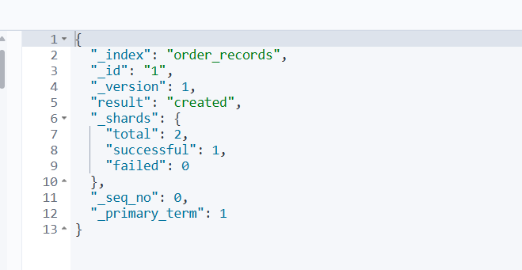

2.修改文档

修改`order_records`下创建的文档内容

代码如下:

```
POST /order_records/_update/1
{
  "doc": {
    "status": "delivered",
    "delivery_date": "2024-09-19"
  }
}

```

运行结果：

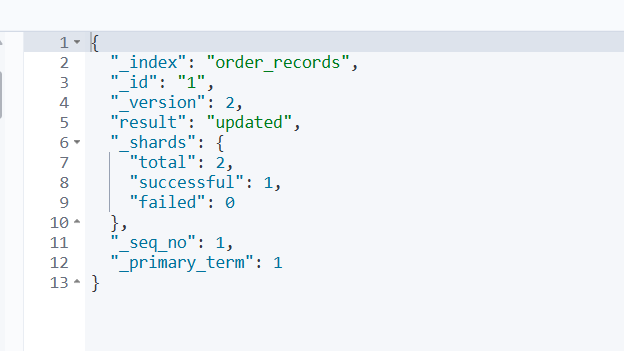

3.查看文档

使用`GET /order_records/_doc/1`查看文档

运行结果：

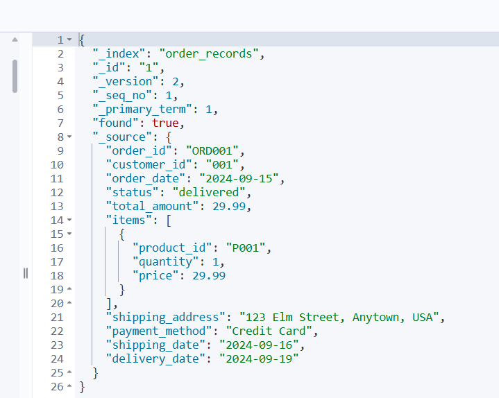

4.删除文档

使用`DELETE /order_records/_doc/1`删除文档

运行结果：

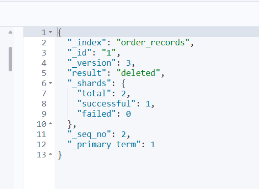

5.批量插入数据

代码如下：

```
POST /order_records/_bulk
{"index":{"_id":"001"}}
{"order_id":"OR001","customer_id":"C001","order_date":"2024-01-10","status":"completed","total_amount":150.75,"items":[{"product_id":"P001","quantity":2,"price":50},{"product_id":"P002","quantity":1,"price":50.75}],"shipping_address":"123 Main St, Anytown, USA","payment_method":"credit_card","shipping_date":"2024-01-11","delivery_date":"2024-01-15"}
{"index":{"_id":"002"}}
{"order_id":"OR002","customer_id":"C002","order_date":"2024-01-15","status":"pending","total_amount":89.99,"items":[{"product_id":"P003","quantity":1,"price":89.99}],"shipping_address":"456 Elm St, Othertown, USA","payment_method":"paypal","shipping_date":"2024-01-16","delivery_date":"2024-01-20"}
{"index":{"_id":"003"}}
{"order_id":"OR003","customer_id":"C003","order_date":"2024-01-20","status":"shipped","total_amount":120.5,"items":[{"product_id":"P004","quantity":3,"price":40}],"shipping_address":"789 Maple Ave, Sometown, USA","payment_method":"debit_card","shipping_date":"2024-01-21","delivery_date":"2024-01-25"}
{"index":{"_id":"004"}}
{"order_id":"OR004","customer_id":"C004","order_date":"2024-01-25","status":"completed","total_amount":75,"items":[{"product_id":"P005","quantity":5,"price":15}],"shipping_address":"101 Oak St, Anycity, USA","payment_method":"credit_card","shipping_date":"2024-01-26","delivery_date":"2024-01-30"}
{"index":{"_id":"005"}}
{"order_id":"OR005","customer_id":"C005","order_date":"2024-02-01","status":"cancelled","total_amount":200,"items":[{"product_id":"P006","quantity":2,"price":100}],"shipping_address":"202 Pine St, Otherville, USA","payment_method":"bank_transfer","shipping_date":"2024-02-02","delivery_date":"2024-02-06"}
{"index":{"_id":"006"}}
{"order_id":"OR006","customer_id":"C006","order_date":"2024-02-05","status":"completed","total_amount":300.25,"items":[{"product_id":"P007","quantity":1,"price":300.25}],"shipping_address":"303 Cedar Rd, Newtown, USA","payment_method":"credit_card","shipping_date":"2024-02-06","delivery_date":"2024-02-10"}
{"index":{"_id":"007"}}
{"order_id":"OR007","customer_id":"C007","order_date":"2024-02-10","status":"pending","total_amount":45.99,"items":[{"product_id":"P008","quantity":3,"price":15.33}],"shipping_address":"404 Birch Ln, Oldtown, USA","payment_method":"paypal","shipping_date":"2024-02-11","delivery_date":"2024-02-15"}
{"index":{"_id":"008"}}
{"order_id":"OR008","customer_id":"C008","order_date":"2024-02-15","status":"shipped","total_amount":89.5,"items":[{"product_id":"P009","quantity":2,"price":44.75}],"shipping_address":"505 Spruce St, Littletown, USA","payment_method":"debit_card","shipping_date":"2024-02-16","delivery_date":"2024-02-20"}
{"index":{"_id":"009"}}
{"order_id":"OR009","customer_id":"C009","order_date":"2024-02-20","status":"completed","total_amount":60,"items":[{"product_id":"P010","quantity":4,"price":15}],"shipping_address":"606 Willow Ave, Bigcity, USA","payment_method":"credit_card","shipping_date":"2024-02-21","delivery_date":"2024-02-25"}
{"index":{"_id":"010"}}
{"order_id":"OR010","customer_id":"C010","order_date":"2024-02-25","status":"cancelled","total_amount":150,"items":[{"product_id":"P011","quantity":10,"price":15}],"shipping_address":"707 Poplar Dr, Smalltown, USA","payment_method":"bank_transfer","shipping_date":"2024-02-26","delivery_date":"2024-03-01"}
{"index":{"_id":"011"}}
{"order_id":"OR011","customer_id":"C011","order_date":"2024-03-01","status":"completed","total_amount":110,"items":[{"product_id":"P012","quantity":2,"price":55}],"shipping_address":"808 Chestnut Blvd, Metropolis, USA","payment_method":"credit_card","shipping_date":"2024-03-02","delivery_date":"2024-03-06"}
{"index":{"_id":"012"}}
{"order_id":"OR012","customer_id":"C012","order_date":"2024-03-05","status":"pending","total_amount":75.99,"items":[{"product_id":"P013","quantity":3,"price":25.33}],"shipping_address":"909 Ash Ct, Villagetown, USA","payment_method":"paypal","shipping_date":"2024-03-06","delivery_date":"2024-03-10"}
{"index":{"_id":"013"}}
{"order_id":"OR013","customer_id":"C013","order_date":"2024-03-10","status":"shipped","total_amount":200,"items":[{"product_id":"P014","quantity":4,"price":50}],"shipping_address":"1010 Fir Ln, Hamlet, USA","payment_method":"debit_card","shipping_date":"2024-03-11","delivery_date":"2024-03-15"}
{"index":{"_id":"014"}}
{"order_id":"OR014","customer_id":"C014","order_date":"2024-03-15","status":"completed","total_amount":90,"items":[{"product_id":"P015","quantity":6,"price":15}],"shipping_address":"1111 Cypress St, Township, USA","payment_method":"credit_card","shipping_date":"2024-03-16","delivery_date":"2024-03-20"}
{"index":{"_id":"015"}}
{"order_id":"OR015","customer_id":"C015","order_date":"2024-03-20","status":"cancelled","total_amount":135,"items":[{"product_id":"P016","quantity":9,"price":15}],"shipping_address":"1212 Redwood Rd, Cityville, USA","payment_method":"bank_transfer","shipping_date":"2024-03-21","delivery_date":"2024-03-25"}
{"index":{"_id":"016"}}
{"order_id":"OR016","customer_id":"C016","order_date":"2024-03-25","status":"completed","total_amount":250,"items":[{"product_id":"P017","quantity":5,"price":50}],"shipping_address":"1313 Cherry Ave, Urbantown, USA","payment_method":"credit_card","shipping_date":"2024-03-26","delivery_date":"2024-03-30"}
{"index":{"_id":"017"}}
{"order_id":"OR017","customer_id":"C017","order_date":"2024-03-30","status":"pending","total_amount":60,"items":[{"product_id":"P018","quantity":2,"price":30}],"shipping_address":"1414 Beech St, Suburbia, USA","payment_method":"paypal","shipping_date":"2024-03-31","delivery_date":"2024-04-04"}
{"index":{"_id":"018"}}
{"order_id":"OR018","customer_id":"C018","order_date":"2024-04-04","status":"shipped","total_amount":100,"items":[{"product_id":"P019","quantity":4,"price":25}],"shipping_address":"1515 Palm Dr, Downtown, USA","payment_method":"debit_card","shipping_date":"2024-04-05","delivery_date":"2024-04-09"}
{"index":{"_id":"019"}}
{"order_id":"OR019","customer_id":"C019","order_date":"2024-04-09","status":"completed","total_amount":180,"items":[{"product_id":"P020","quantity":6,"price":30}],"shipping_address":"1616 Pine St, Uptown, USA","payment_method":"credit_card","shipping_date":"2024-04-10","delivery_date":"2024-04-14"}
{"index":{"_id":"020"}}
{"order_id":"OR020","customer_id":"C020","order_date":"2024-04-14","status":"cancelled","total_amount":220,"items":[{"product_id":"P021","quantity":11,"price":20}],"shipping_address":"1717 Maple Ave, Seaside, USA","payment_method":"bank_transfer","shipping_date":"2024-04-15","delivery_date":"2024-04-19"}
```

运行结果：

```
{
  "errors": false,
  "took": 11,
  "items": [
    {
      "index": {
        "_index": "order_records",
        "_id": "001",
        "_version": 1,
        "result": "created",
        "_shards": {
          "total": 2,
          "successful": 1,
          "failed": 0
        },
        "_seq_no": 0,
        "_primary_term": 1,
        "status": 201
      }
    },
    {
      "index": {
        "_index": "order_records",
        "_id": "002",
        "_version": 1,
        "result": "created",
        "_shards": {
          "total": 2,
          "successful": 1,
          "failed": 0
        },
        "_seq_no": 1,
        "_primary_term": 1,
        "status": 201
      }
    },
    {
      "index": {
        "_index": "order_records",
        "_id": "003",
        "_version": 1,
        "result": "created",
        "_shards": {
          "total": 2,
          "successful": 1,
          "failed": 0
        },
        "_seq_no": 2,
        "_primary_term": 1,
        "status": 201
      }
    },
    {
      "index": {
        "_index": "order_records",
        "_id": "004",
        "_version": 1,
        "result": "created",
        "_shards": {
          "total": 2,
          "successful": 1,
          "failed": 0
        },
        "_seq_no": 3,
        "_primary_term": 1,
        "status": 201
      }
    },
    {
      "index": {
        "_index": "order_records",
        "_id": "005",
        "_version": 1,
        "result": "created",
        "_shards": {
          "total": 2,
          "successful": 1,
          "failed": 0
        },
        "_seq_no": 4,
        "_primary_term": 1,
        "status": 201
      }
    },
    {
      "index": {
        "_index": "order_records",
        "_id": "006",
        "_version": 1,
        "result": "created",
        "_shards": {
          "total": 2,
          "successful": 1,
          "failed": 0
        },
        "_seq_no": 5,
        "_primary_term": 1,
        "status": 201
      }
    },
    {
      "index": {
        "_index": "order_records",
        "_id": "007",
        "_version": 1,
        "result": "created",
        "_shards": {
          "total": 2,
          "successful": 1,
          "failed": 0
        },
        "_seq_no": 6,
        "_primary_term": 1,
        "status": 201
      }
    },
    {
      "index": {
        "_index": "order_records",
        "_id": "008",
        "_version": 1,
        "result": "created",
        "_shards": {
          "total": 2,
          "successful": 1,
          "failed": 0
        },
        "_seq_no": 7,
        "_primary_term": 1,
        "status": 201
      }
    },
    {
      "index": {
        "_index": "order_records",
        "_id": "009",
        "_version": 1,
        "result": "created",
        "_shards": {
          "total": 2,
          "successful": 1,
          "failed": 0
        },
        "_seq_no": 8,
        "_primary_term": 1,
        "status": 201
      }
    },
    {
      "index": {
        "_index": "order_records",
        "_id": "010",
        "_version": 1,
        "result": "created",
        "_shards": {
          "total": 2,
          "successful": 1,
          "failed": 0
        },
        "_seq_no": 9,
        "_primary_term": 1,
        "status": 201
      }
    },
    {
      "index": {
        "_index": "order_records",
        "_id": "011",
        "_version": 1,
        "result": "created",
        "_shards": {
          "total": 2,
          "successful": 1,
          "failed": 0
        },
        "_seq_no": 10,
        "_primary_term": 1,
        "status": 201
      }
    },
    {
      "index": {
        "_index": "order_records",
        "_id": "012",
        "_version": 1,
        "result": "created",
        "_shards": {
          "total": 2,
          "successful": 1,
          "failed": 0
        },
        "_seq_no": 11,
        "_primary_term": 1,
        "status": 201
      }
    },
    {
      "index": {
        "_index": "order_records",
        "_id": "013",
        "_version": 1,
        "result": "created",
        "_shards": {
          "total": 2,
          "successful": 1,
          "failed": 0
        },
        "_seq_no": 12,
        "_primary_term": 1,
        "status": 201
      }
    },
    {
      "index": {
        "_index": "order_records",
        "_id": "014",
        "_version": 1,
        "result": "created",
        "_shards": {
          "total": 2,
          "successful": 1,
          "failed": 0
        },
        "_seq_no": 13,
        "_primary_term": 1,
        "status": 201
      }
    },
    {
      "index": {
        "_index": "order_records",
        "_id": "015",
        "_version": 1,
        "result": "created",
        "_shards": {
          "total": 2,
          "successful": 1,
          "failed": 0
        },
        "_seq_no": 14,
        "_primary_term": 1,
        "status": 201
      }
    },
    {
      "index": {
        "_index": "order_records",
        "_id": "016",
        "_version": 1,
        "result": "created",
        "_shards": {
          "total": 2,
          "successful": 1,
          "failed": 0
        },
        "_seq_no": 15,
        "_primary_term": 1,
        "status": 201
      }
    },
    {
      "index": {
        "_index": "order_records",
        "_id": "017",
        "_version": 1,
        "result": "created",
        "_shards": {
          "total": 2,
          "successful": 1,
          "failed": 0
        },
        "_seq_no": 16,
        "_primary_term": 1,
        "status": 201
      }
    },
    {
      "index": {
        "_index": "order_records",
        "_id": "018",
        "_version": 1,
        "result": "created",
        "_shards": {
          "total": 2,
          "successful": 1,
          "failed": 0
        },
        "_seq_no": 17,
        "_primary_term": 1,
        "status": 201
      }
    },
    {
      "index": {
        "_index": "order_records",
        "_id": "019",
        "_version": 1,
        "result": "created",
        "_shards": {
          "total": 2,
          "successful": 1,
          "failed": 0
        },
        "_seq_no": 18,
        "_primary_term": 1,
        "status": 201
      }
    },
    {
      "index": {
        "_index": "order_records",
        "_id": "020",
        "_version": 1,
        "result": "created",
        "_shards": {
          "total": 2,
          "successful": 1,
          "failed": 0
        },
        "_seq_no": 19,
        "_primary_term": 1,
        "status": 201
      }
    }
  ]
}
```

### 4.Elasticsearch 高级查询与DSL训练

任务三：
完成下面的30道练习题

#### 4.1用户信息数据

1.**查询所有女性用户的姓名和电子邮件。**
代码如下：

```
GET /user_information/_search
{
  "query": {
    "match": {
      "gender": "female"
    }
  },
  "_source": ["name", "email"]
}
```

运行结果：

```
{
  "took": 11,
  "timed_out": false,
  "_shards": {
    "total": 1,
    "successful": 1,
    "skipped": 0,
    "failed": 0
  },
  "hits": {
    "total": {
      "value": 10,
      "relation": "eq"
    },
    "max_score": 0.6931471,
    "hits": [
      {
        "_index": "user_information",
        "_id": "001",
        "_score": 0.6931471,
        "_source": {
          "name": "Alice Johnson",
          "email": "alice.johnson@example.com"
        }
      },
      {
        "_index": "user_information",
        "_id": "005",
        "_score": 0.6931471,
        "_source": {
          "name": "Eve Davis",
          "email": "eve.davis@example.com"
        }
      },
      {
        "_index": "user_information",
        "_id": "007",
        "_score": 0.6931471,
        "_source": {
          "name": "Grace Lee",
          "email": "grace.lee@example.com"
        }
      },
      {
        "_index": "user_information",
        "_id": "008",
        "_score": 0.6931471,
        "_source": {
          "name": "Hannah White",
          "email": "hannah.white@example.com"
        }
      },
      {
        "_index": "user_information",
        "_id": "009",
        "_score": 0.6931471,
        "_source": {
          "name": "Ivy Green",
          "email": "ivy.green@example.com"
        }
      },
      {
        "_index": "user_information",
        "_id": "011",
        "_score": 0.6931471,
        "_source": {
          "name": "Karen Adams",
          "email": "karen.adams@example.com"
        }
      },
      {
        "_index": "user_information",
        "_id": "013",
        "_score": 0.6931471,
        "_source": {
          "name": "Mia Moore",
          "email": "mia.moore@example.com"
        }
      },
      {
        "_index": "user_information",
        "_id": "014",
        "_score": 0.6931471,
        "_source": {
          "name": "Nina Scott",
          "email": "nina.scott@example.com"
        }
      },
      {
        "_index": "user_information",
        "_id": "018",
        "_score": 0.6931471,
        "_source": {
          "name": "Rose Hall",
          "email": "rose.hall@example.com"
        }
      },
      {
        "_index": "user_information",
        "_id": "020",
        "_score": 0.6931471,
        "_source": {
          "name": "Tina Brown",
          "email": "tina.brown@example.com"
        }
      }
    ]
  }
}
```

2.**查找最后登录日期在2024年9月1日之后的所有活跃用户。**

代码如下：

```
GET /user_information/_search
{
  "query": {
    "bool": {
      "must": [
        {
          "range": {
            "last_login": {
              "gte": "2024-09-01"
            }
          }
        },
        {
          "match": {
            "status": "active"
          }
        }
      ]
    }
  }
}
```

运行结果：

```
{
  "took": 3,
  "timed_out": false,
  "_shards": {
    "total": 1,
    "successful": 1,
    "skipped": 0,
    "failed": 0
  },
  "hits": {
    "total": {
      "value": 12,
      "relation": "eq"
    },
    "max_score": 1.3703737,
    "hits": [
      {
        "_index": "user_information",
        "_id": "001",
        "_score": 1.3703737,
        "_source": {
          "user_id": "001",
          "name": "Alice Johnson",
          "email": "alice.johnson@example.com",
          "date_of_birth": "1990-05-15",
          "gender": "female",
          "address": "123 Main St, Anytown, USA",
          "phone_number": "123-456-7890",
          "registration_date": "2023-01-15",
          "last_login": "2024-09-01",
          "status": "active"
        }
      },
      {
        "_index": "user_information",
        "_id": "005",
        "_score": 1.3703737,
        "_source": {
          "user_id": "005",
          "name": "Eve Davis",
          "email": "eve.davis@example.com",
          "date_of_birth": "1995-07-22",
          "gender": "female",
          "address": "202 Pine St, Otherville, USA",
          "phone_number": "567-890-1234",
          "registration_date": "2023-05-18",
          "last_login": "2024-09-02",
          "status": "active"
        }
      },
      {
        "_index": "user_information",
        "_id": "006",
        "_score": 1.3703737,
        "_source": {
          "user_id": "006",
          "name": "Frank Miller",
          "email": "frank.miller@example.com",
          "date_of_birth": "1991-10-05",
          "gender": "male",
          "address": "303 Cedar Rd, Newtown, USA",
          "phone_number": "678-901-2345",
          "registration_date": "2023-06-22",
          "last_login": "2024-09-03",
          "status": "active"
        }
      },
      {
        "_index": "user_information",
        "_id": "008",
        "_score": 1.3703737,
        "_source": {
          "user_id": "008",
          "name": "Hannah White",
          "email": "hannah.white@example.com",
          "date_of_birth": "1993-12-25",
          "gender": "female",
          "address": "505 Spruce St, Littletown, USA",
          "phone_number": "890-123-4567",
          "registration_date": "2023-08-15",
          "last_login": "2024-09-06",
          "status": "active"
        }
      },
      {
        "_index": "user_information",
        "_id": "009",
        "_score": 1.3703737,
        "_source": {
          "user_id": "009",
          "name": "Ivy Green",
          "email": "ivy.green@example.com",
          "date_of_birth": "1994-03-03",
          "gender": "female",
          "address": "606 Willow Ave, Bigcity, USA",
          "phone_number": "901-234-5678",
          "registration_date": "2023-09-01",
          "last_login": "2024-09-07",
          "status": "active"
        }
      },
      {
        "_index": "user_information",
        "_id": "011",
        "_score": 1.3703737,
        "_source": {
          "user_id": "011",
          "name": "Karen Adams",
          "email": "karen.adams@example.com",
          "date_of_birth": "1990-09-21",
          "gender": "female",
          "address": "808 Chestnut Blvd, Metropolis, USA",
          "phone_number": "123-456-7890",
          "registration_date": "2023-11-25",
          "last_login": "2024-09-09",
          "status": "active"
        }
      },
      {
        "_index": "user_information",
        "_id": "012",
        "_score": 1.3703737,
        "_source": {
          "user_id": "012",
          "name": "Leo King",
          "email": "leo.king@example.com",
          "date_of_birth": "1986-01-12",
          "gender": "male",
          "address": "909 Ash Ct, Villagetown, USA",
          "phone_number": "234-567-8901",
          "registration_date": "2023-12-05",
          "last_login": "2024-09-10",
          "status": "active"
        }
      },
      {
        "_index": "user_information",
        "_id": "014",
        "_score": 1.3703737,
        "_source": {
          "user_id": "014",
          "name": "Nina Scott",
          "email": "nina.scott@example.com",
          "date_of_birth": "1988-05-05",
          "gender": "female",
          "address": "1111 Cypress St, Township, USA",
          "phone_number": "456-789-0123",
          "registration_date": "2024-02-14",
          "last_login": "2024-09-12",
          "status": "active"
        }
      },
      {
        "_index": "user_information",
        "_id": "015",
        "_score": 1.3703737,
        "_source": {
          "user_id": "015",
          "name": "Oscar Turner",
          "email": "oscar.turner@example.com",
          "date_of_birth": "1991-07-19",
          "gender": "male",
          "address": "1212 Redwood Rd, Cityville, USA",
          "phone_number": "567-890-1234",
          "registration_date": "2024-03-20",
          "last_login": "2024-09-13",
          "status": "active"
        }
      },
      {
        "_index": "user_information",
        "_id": "017",
        "_score": 1.3703737,
        "_source": {
          "user_id": "017",
          "name": "Quinn Hughes",
          "email": "quinn.hughes@example.com",
          "date_of_birth": "1993-11-11",
          "gender": "male",
          "address": "1414 Beech St, Suburbia, USA",
          "phone_number": "789-012-3456",
          "registration_date": "2024-05-30",
          "last_login": "2024-09-15",
          "status": "active"
        }
      }
    ]
  }
}
```

3.**查询住在"Anytown"的用户。**

代码如下：

```
GET /user_information/_search
{
  "query": {
    "match_phrase": {
      "address": "Anytown"
    }
  }
}
```

运行结果：

```
{
  "took": 1,
  "timed_out": false,
  "_shards": {
    "total": 1,
    "successful": 1,
    "skipped": 0,
    "failed": 0
  },
  "hits": {
    "total": {
      "value": 1,
      "relation": "eq"
    },
    "max_score": 2.6390574,
    "hits": [
      {
        "_index": "user_information",
        "_id": "001",
        "_score": 2.6390574,
        "_source": {
          "user_id": "001",
          "name": "Alice Johnson",
          "email": "alice.johnson@example.com",
          "date_of_birth": "1990-05-15",
          "gender": "female",
          "address": "123 Main St, Anytown, USA",
          "phone_number": "123-456-7890",
          "registration_date": "2023-01-15",
          "last_login": "2024-09-01",
          "status": "active"
        }
      }
    ]
  }
}
```

4.**查找出生日期在1990年之后的所有用户。**

代码如下：

```
GET /user_information/_search
{
  "query": {
    "range": {
      "date_of_birth": {
        "gte": "1990-01-01"
      }
    }
  }
}
```

运行结果：

```
{
  "took": 0,
  "timed_out": false,
  "_shards": {
    "total": 1,
    "successful": 1,
    "skipped": 0,
    "failed": 0
  },
  "hits": {
    "total": {
      "value": 12,
      "relation": "eq"
    },
    "max_score": 1,
    "hits": [
      {
        "_index": "user_information",
        "_id": "001",
        "_score": 1,
        "_source": {
          "user_id": "001",
          "name": "Alice Johnson",
          "email": "alice.johnson@example.com",
          "date_of_birth": "1990-05-15",
          "gender": "female",
          "address": "123 Main St, Anytown, USA",
          "phone_number": "123-456-7890",
          "registration_date": "2023-01-15",
          "last_login": "2024-09-01",
          "status": "active"
        }
      },
      {
        "_index": "user_information",
        "_id": "003",
        "_score": 1,
        "_source": {
          "user_id": "003",
          "name": "Charlie Brown",
          "email": "charlie.brown@example.com",
          "date_of_birth": "1992-11-30",
          "gender": "male",
          "address": "789 Maple Ave, Sometown, USA",
          "phone_number": "345-678-9012",
          "registration_date": "2023-03-10",
          "last_login": "2024-09-05",
          "status": "inactive"
        }
      },
      {
        "_index": "user_information",
        "_id": "005",
        "_score": 1,
        "_source": {
          "user_id": "005",
          "name": "Eve Davis",
          "email": "eve.davis@example.com",
          "date_of_birth": "1995-07-22",
          "gender": "female",
          "address": "202 Pine St, Otherville, USA",
          "phone_number": "567-890-1234",
          "registration_date": "2023-05-18",
          "last_login": "2024-09-02",
          "status": "active"
        }
      },
      {
        "_index": "user_information",
        "_id": "006",
        "_score": 1,
        "_source": {
          "user_id": "006",
          "name": "Frank Miller",
          "email": "frank.miller@example.com",
          "date_of_birth": "1991-10-05",
          "gender": "male",
          "address": "303 Cedar Rd, Newtown, USA",
          "phone_number": "678-901-2345",
          "registration_date": "2023-06-22",
          "last_login": "2024-09-03",
          "status": "active"
        }
      },
      {
        "_index": "user_information",
        "_id": "008",
        "_score": 1,
        "_source": {
          "user_id": "008",
          "name": "Hannah White",
          "email": "hannah.white@example.com",
          "date_of_birth": "1993-12-25",
          "gender": "female",
          "address": "505 Spruce St, Littletown, USA",
          "phone_number": "890-123-4567",
          "registration_date": "2023-08-15",
          "last_login": "2024-09-06",
          "status": "active"
        }
      },
      {
        "_index": "user_information",
        "_id": "009",
        "_score": 1,
        "_source": {
          "user_id": "009",
          "name": "Ivy Green",
          "email": "ivy.green@example.com",
          "date_of_birth": "1994-03-03",
          "gender": "female",
          "address": "606 Willow Ave, Bigcity, USA",
          "phone_number": "901-234-5678",
          "registration_date": "2023-09-01",
          "last_login": "2024-09-07",
          "status": "active"
        }
      },
      {
        "_index": "user_information",
        "_id": "011",
        "_score": 1,
        "_source": {
          "user_id": "011",
          "name": "Karen Adams",
          "email": "karen.adams@example.com",
          "date_of_birth": "1990-09-21",
          "gender": "female",
          "address": "808 Chestnut Blvd, Metropolis, USA",
          "phone_number": "123-456-7890",
          "registration_date": "2023-11-25",
          "last_login": "2024-09-09",
          "status": "active"
        }
      },
      {
        "_index": "user_information",
        "_id": "013",
        "_score": 1,
        "_source": {
          "user_id": "013",
          "name": "Mia Moore",
          "email": "mia.moore@example.com",
          "date_of_birth": "1992-02-28",
          "gender": "female",
          "address": "1010 Fir Ln, Hamlet, USA",
          "phone_number": "345-678-9012",
          "registration_date": "2024-01-10",
          "last_login": "2024-09-11",
          "status": "inactive"
        }
      },
      {
        "_index": "user_information",
        "_id": "015",
        "_score": 1,
        "_source": {
          "user_id": "015",
          "name": "Oscar Turner",
          "email": "oscar.turner@example.com",
          "date_of_birth": "1991-07-19",
          "gender": "male",
          "address": "1212 Redwood Rd, Cityville, USA",
          "phone_number": "567-890-1234",
          "registration_date": "2024-03-20",
          "last_login": "2024-09-13",
          "status": "active"
        }
      },
      {
        "_index": "user_information",
        "_id": "017",
        "_score": 1,
        "_source": {
          "user_id": "017",
          "name": "Quinn Hughes",
          "email": "quinn.hughes@example.com",
          "date_of_birth": "1993-11-11",
          "gender": "male",
          "address": "1414 Beech St, Suburbia, USA",
          "phone_number": "789-012-3456",
          "registration_date": "2024-05-30",
          "last_login": "2024-09-15",
          "status": "active"
        }
      }
    ]
  }
}
```

5.**查询所有状态为"inactive"的用户。**

代码如下：

```
GET /user_information/_search
{
  "query": {
    "match": {
      "status": "inactive"
    }
  }
}
```

运行结果：

```
{
  "took": 0,
  "timed_out": false,
  "_shards": {
    "total": 1,
    "successful": 1,
    "skipped": 0,
    "failed": 0
  },
  "hits": {
    "total": {
      "value": 6,
      "relation": "eq"
    },
    "max_score": 1.1727202,
    "hits": [
      {
        "_index": "user_information",
        "_id": "003",
        "_score": 1.1727202,
        "_source": {
          "user_id": "003",
          "name": "Charlie Brown",
          "email": "charlie.brown@example.com",
          "date_of_birth": "1992-11-30",
          "gender": "male",
          "address": "789 Maple Ave, Sometown, USA",
          "phone_number": "345-678-9012",
          "registration_date": "2023-03-10",
          "last_login": "2024-09-05",
          "status": "inactive"
        }
      },
      {
        "_index": "user_information",
        "_id": "007",
        "_score": 1.1727202,
        "_source": {
          "user_id": "007",
          "name": "Grace Lee",
          "email": "grace.lee@example.com",
          "date_of_birth": "1989-04-17",
          "gender": "female",
          "address": "404 Birch Ln, Oldtown, USA",
          "phone_number": "789-012-3456",
          "registration_date": "2023-07-30",
          "last_login": "2024-09-04",
          "status": "inactive"
        }
      },
      {
        "_index": "user_information",
        "_id": "010",
        "_score": 1.1727202,
        "_source": {
          "user_id": "010",
          "name": "Jack Black",
          "email": "jack.black@example.com",
          "date_of_birth": "1987-06-18",
          "gender": "male",
          "address": "707 Poplar Dr, Smalltown, USA",
          "phone_number": "012-345-6789",
          "registration_date": "2023-10-10",
          "last_login": "2024-09-08",
          "status": "inactive"
        }
      },
      {
        "_index": "user_information",
        "_id": "013",
        "_score": 1.1727202,
        "_source": {
          "user_id": "013",
          "name": "Mia Moore",
          "email": "mia.moore@example.com",
          "date_of_birth": "1992-02-28",
          "gender": "female",
          "address": "1010 Fir Ln, Hamlet, USA",
          "phone_number": "345-678-9012",
          "registration_date": "2024-01-10",
          "last_login": "2024-09-11",
          "status": "inactive"
        }
      },
      {
        "_index": "user_information",
        "_id": "016",
        "_score": 1.1727202,
        "_source": {
          "user_id": "016",
          "name": "Paul Walker",
          "email": "paul.walker@example.com",
          "date_of_birth": "1989-10-10",
          "gender": "male",
          "address": "1313 Cherry Ave, Urbantown, USA",
          "phone_number": "678-901-2345",
          "registration_date": "2024-04-25",
          "last_login": "2024-09-14",
          "status": "inactive"
        }
      },
      {
        "_index": "user_information",
        "_id": "019",
        "_score": 1.1727202,
        "_source": {
          "user_id": "019",
          "name": "Steve Young",
          "email": "steve.young@example.com",
          "date_of_birth": "1987-09-09",
          "gender": "male",
          "address": "1616 Pine St, Uptown, USA",
          "phone_number": "901-234-5678",
          "registration_date": "2024-07-20",
          "last_login": "2024-09-17",
          "status": "inactive"
        }
      }
    ]
  }
}
```

6.**查找注册日期在2023年1月1日到2023年12月31日之间的用户。**

代码如下：

```
GET /user_information/_search
{
  "query": {
    "range": {
      "registration_date": {
        "gte": "2023-01-01",
        "lte": "2023-12-31"
      }
    }
  }
}
```

运行结果：

```
{
  "took": 0,
  "timed_out": false,
  "_shards": {
    "total": 1,
    "successful": 1,
    "skipped": 0,
    "failed": 0
  },
  "hits": {
    "total": {
      "value": 12,
      "relation": "eq"
    },
    "max_score": 1,
    "hits": [
      {
        "_index": "user_information",
        "_id": "001",
        "_score": 1,
        "_source": {
          "user_id": "001",
          "name": "Alice Johnson",
          "email": "alice.johnson@example.com",
          "date_of_birth": "1990-05-15",
          "gender": "female",
          "address": "123 Main St, Anytown, USA",
          "phone_number": "123-456-7890",
          "registration_date": "2023-01-15",
          "last_login": "2024-09-01",
          "status": "active"
        }
      },
      {
        "_index": "user_information",
        "_id": "002",
        "_score": 1,
        "_source": {
          "user_id": "002",
          "name": "Bob Smith",
          "email": "bob.smith@example.com",
          "date_of_birth": "1985-08-20",
          "gender": "male",
          "address": "456 Elm St, Othertown, USA",
          "phone_number": "234-567-8901",
          "registration_date": "2023-02-20",
          "last_login": "2024-08-25",
          "status": "active"
        }
      },
      {
        "_index": "user_information",
        "_id": "003",
        "_score": 1,
        "_source": {
          "user_id": "003",
          "name": "Charlie Brown",
          "email": "charlie.brown@example.com",
          "date_of_birth": "1992-11-30",
          "gender": "male",
          "address": "789 Maple Ave, Sometown, USA",
          "phone_number": "345-678-9012",
          "registration_date": "2023-03-10",
          "last_login": "2024-09-05",
          "status": "inactive"
        }
      },
      {
        "_index": "user_information",
        "_id": "004",
        "_score": 1,
        "_source": {
          "user_id": "004",
          "name": "David Wilson",
          "email": "david.wilson@example.com",
          "date_of_birth": "1988-02-14",
          "gender": "male",
          "address": "101 Oak St, Anycity, USA",
          "phone_number": "456-789-0123",
          "registration_date": "2023-04-05",
          "last_login": "2024-08-30",
          "status": "active"
        }
      },
      {
        "_index": "user_information",
        "_id": "005",
        "_score": 1,
        "_source": {
          "user_id": "005",
          "name": "Eve Davis",
          "email": "eve.davis@example.com",
          "date_of_birth": "1995-07-22",
          "gender": "female",
          "address": "202 Pine St, Otherville, USA",
          "phone_number": "567-890-1234",
          "registration_date": "2023-05-18",
          "last_login": "2024-09-02",
          "status": "active"
        }
      },
      {
        "_index": "user_information",
        "_id": "006",
        "_score": 1,
        "_source": {
          "user_id": "006",
          "name": "Frank Miller",
          "email": "frank.miller@example.com",
          "date_of_birth": "1991-10-05",
          "gender": "male",
          "address": "303 Cedar Rd, Newtown, USA",
          "phone_number": "678-901-2345",
          "registration_date": "2023-06-22",
          "last_login": "2024-09-03",
          "status": "active"
        }
      },
      {
        "_index": "user_information",
        "_id": "007",
        "_score": 1,
        "_source": {
          "user_id": "007",
          "name": "Grace Lee",
          "email": "grace.lee@example.com",
          "date_of_birth": "1989-04-17",
          "gender": "female",
          "address": "404 Birch Ln, Oldtown, USA",
          "phone_number": "789-012-3456",
          "registration_date": "2023-07-30",
          "last_login": "2024-09-04",
          "status": "inactive"
        }
      },
      {
        "_index": "user_information",
        "_id": "008",
        "_score": 1,
        "_source": {
          "user_id": "008",
          "name": "Hannah White",
          "email": "hannah.white@example.com",
          "date_of_birth": "1993-12-25",
          "gender": "female",
          "address": "505 Spruce St, Littletown, USA",
          "phone_number": "890-123-4567",
          "registration_date": "2023-08-15",
          "last_login": "2024-09-06",
          "status": "active"
        }
      },
      {
        "_index": "user_information",
        "_id": "009",
        "_score": 1,
        "_source": {
          "user_id": "009",
          "name": "Ivy Green",
          "email": "ivy.green@example.com",
          "date_of_birth": "1994-03-03",
          "gender": "female",
          "address": "606 Willow Ave, Bigcity, USA",
          "phone_number": "901-234-5678",
          "registration_date": "2023-09-01",
          "last_login": "2024-09-07",
          "status": "active"
        }
      },
      {
        "_index": "user_information",
        "_id": "010",
        "_score": 1,
        "_source": {
          "user_id": "010",
          "name": "Jack Black",
          "email": "jack.black@example.com",
          "date_of_birth": "1987-06-18",
          "gender": "male",
          "address": "707 Poplar Dr, Smalltown, USA",
          "phone_number": "012-345-6789",
          "registration_date": "2023-10-10",
          "last_login": "2024-09-08",
          "status": "inactive"
        }
      }
    ]
  }
}
```

7.**查询名字为"Bob Smith"的用户的详细信息。**

代码如下：

```
GET /user_information/_search
{
  "query": {
    "match": {
      "name": "Bob Smith"
    }
  }
}
```

运行结果：

```
{
  "took": 3,
  "timed_out": false,
  "_shards": {
    "total": 1,
    "successful": 1,
    "skipped": 0,
    "failed": 0
  },
  "hits": {
    "total": {
      "value": 1,
      "relation": "eq"
    },
    "max_score": 5.278115,
    "hits": [
      {
        "_index": "user_information",
        "_id": "002",
        "_score": 5.278115,
        "_source": {
          "user_id": "002",
          "name": "Bob Smith",
          "email": "bob.smith@example.com",
          "date_of_birth": "1985-08-20",
          "gender": "male",
          "address": "456 Elm St, Othertown, USA",
          "phone_number": "234-567-8901",
          "registration_date": "2023-02-20",
          "last_login": "2024-08-25",
          "status": "active"
        }
      }
    ]
  }
}
```

8.**查找电话号码以"123"开头的用户。**

代码如下：

```
GET /user_information/_search
{
  "query": {
    "prefix": {
      "phone_number": "123"
    }
  }
}
```

运行结果：

```
{
  "took": 1,
  "timed_out": false,
  "_shards": {
    "total": 1,
    "successful": 1,
    "skipped": 0,
    "failed": 0
  },
  "hits": {
    "total": {
      "value": 2,
      "relation": "eq"
    },
    "max_score": 1,
    "hits": [
      {
        "_index": "user_information",
        "_id": "001",
        "_score": 1,
        "_source": {
          "user_id": "001",
          "name": "Alice Johnson",
          "email": "alice.johnson@example.com",
          "date_of_birth": "1990-05-15",
          "gender": "female",
          "address": "123 Main St, Anytown, USA",
          "phone_number": "123-456-7890",
          "registration_date": "2023-01-15",
          "last_login": "2024-09-01",
          "status": "active"
        }
      },
      {
        "_index": "user_information",
        "_id": "011",
        "_score": 1,
        "_source": {
          "user_id": "011",
          "name": "Karen Adams",
          "email": "karen.adams@example.com",
          "date_of_birth": "1990-09-21",
          "gender": "female",
          "address": "808 Chestnut Blvd, Metropolis, USA",
          "phone_number": "123-456-7890",
          "registration_date": "2023-11-25",
          "last_login": "2024-09-09",
          "status": "active"
        }
      }
    ]
  }
}
```

9.**查询电子邮件域为"example.com"的所有用户。**

代码如下：

```
GET /user_information/_search
{
  "query": {
    "wildcard": {
      "email": {
        "value": "*@example.com"
      }
    }
  }
}

```

运行结果：

```
{
  "took": 3,
  "timed_out": false,
  "_shards": {
    "total": 1,
    "successful": 1,
    "skipped": 0,
    "failed": 0
  },
  "hits": {
    "total": {
      "value": 20,
      "relation": "eq"
    },
    "max_score": 1,
    "hits": [
      {
        "_index": "user_information",
        "_id": "001",
        "_score": 1,
        "_source": {
          "user_id": "001",
          "name": "Alice Johnson",
          "email": "alice.johnson@example.com",
          "date_of_birth": "1990-05-15",
          "gender": "female",
          "address": "123 Main St, Anytown, USA",
          "phone_number": "123-456-7890",
          "registration_date": "2023-01-15",
          "last_login": "2024-09-01",
          "status": "active"
        }
      },
      {
        "_index": "user_information",
        "_id": "002",
        "_score": 1,
        "_source": {
          "user_id": "002",
          "name": "Bob Smith",
          "email": "bob.smith@example.com",
          "date_of_birth": "1985-08-20",
          "gender": "male",
          "address": "456 Elm St, Othertown, USA",
          "phone_number": "234-567-8901",
          "registration_date": "2023-02-20",
          "last_login": "2024-08-25",
          "status": "active"
        }
      },
      {
        "_index": "user_information",
        "_id": "003",
        "_score": 1,
        "_source": {
          "user_id": "003",
          "name": "Charlie Brown",
          "email": "charlie.brown@example.com",
          "date_of_birth": "1992-11-30",
          "gender": "male",
          "address": "789 Maple Ave, Sometown, USA",
          "phone_number": "345-678-9012",
          "registration_date": "2023-03-10",
          "last_login": "2024-09-05",
          "status": "inactive"
        }
      },
      {
        "_index": "user_information",
        "_id": "004",
        "_score": 1,
        "_source": {
          "user_id": "004",
          "name": "David Wilson",
          "email": "david.wilson@example.com",
          "date_of_birth": "1988-02-14",
          "gender": "male",
          "address": "101 Oak St, Anycity, USA",
          "phone_number": "456-789-0123",
          "registration_date": "2023-04-05",
          "last_login": "2024-08-30",
          "status": "active"
        }
      },
      {
        "_index": "user_information",
        "_id": "005",
        "_score": 1,
        "_source": {
          "user_id": "005",
          "name": "Eve Davis",
          "email": "eve.davis@example.com",
          "date_of_birth": "1995-07-22",
          "gender": "female",
          "address": "202 Pine St, Otherville, USA",
          "phone_number": "567-890-1234",
          "registration_date": "2023-05-18",
          "last_login": "2024-09-02",
          "status": "active"
        }
      },
      {
        "_index": "user_information",
        "_id": "006",
        "_score": 1,
        "_source": {
          "user_id": "006",
          "name": "Frank Miller",
          "email": "frank.miller@example.com",
          "date_of_birth": "1991-10-05",
          "gender": "male",
          "address": "303 Cedar Rd, Newtown, USA",
          "phone_number": "678-901-2345",
          "registration_date": "2023-06-22",
          "last_login": "2024-09-03",
          "status": "active"
        }
      },
      {
        "_index": "user_information",
        "_id": "007",
        "_score": 1,
        "_source": {
          "user_id": "007",
          "name": "Grace Lee",
          "email": "grace.lee@example.com",
          "date_of_birth": "1989-04-17",
          "gender": "female",
          "address": "404 Birch Ln, Oldtown, USA",
          "phone_number": "789-012-3456",
          "registration_date": "2023-07-30",
          "last_login": "2024-09-04",
          "status": "inactive"
        }
      },
      {
        "_index": "user_information",
        "_id": "008",
        "_score": 1,
        "_source": {
          "user_id": "008",
          "name": "Hannah White",
          "email": "hannah.white@example.com",
          "date_of_birth": "1993-12-25",
          "gender": "female",
          "address": "505 Spruce St, Littletown, USA",
          "phone_number": "890-123-4567",
          "registration_date": "2023-08-15",
          "last_login": "2024-09-06",
          "status": "active"
        }
      },
      {
        "_index": "user_information",
        "_id": "009",
        "_score": 1,
        "_source": {
          "user_id": "009",
          "name": "Ivy Green",
          "email": "ivy.green@example.com",
          "date_of_birth": "1994-03-03",
          "gender": "female",
          "address": "606 Willow Ave, Bigcity, USA",
          "phone_number": "901-234-5678",
          "registration_date": "2023-09-01",
          "last_login": "2024-09-07",
          "status": "active"
        }
      },
      {
        "_index": "user_information",
        "_id": "010",
        "_score": 1,
        "_source": {
          "user_id": "010",
          "name": "Jack Black",
          "email": "jack.black@example.com",
          "date_of_birth": "1987-06-18",
          "gender": "male",
          "address": "707 Poplar Dr, Smalltown, USA",
          "phone_number": "012-345-6789",
          "registration_date": "2023-10-10",
          "last_login": "2024-09-08",
          "status": "inactive"
        }
      }
    ]
  }
}
```

10.**查找所有名字中包含"Lee"的用户。**

代码如下：

```
GET /user_information/_search
{
  "query": {
    "match": {
      "name": "*Lee*"
    }
  }
}
```

运行结果：

```
{
  "took": 0,
  "timed_out": false,
  "_shards": {
    "total": 1,
    "successful": 1,
    "skipped": 0,
    "failed": 0
  },
  "hits": {
    "total": {
      "value": 1,
      "relation": "eq"
    },
    "max_score": 2.6390574,
    "hits": [
      {
        "_index": "user_information",
        "_id": "007",
        "_score": 2.6390574,
        "_source": {
          "user_id": "007",
          "name": "Grace Lee",
          "email": "grace.lee@example.com",
          "date_of_birth": "1989-04-17",
          "gender": "female",
          "address": "404 Birch Ln, Oldtown, USA",
          "phone_number": "789-012-3456",
          "registration_date": "2023-07-30",
          "last_login": "2024-09-04",
          "status": "inactive"
        }
      }
    ]
  }
}
```

#### 4.2产品目录数据

1.**查询所有类别为"Audio"的产品名称和价格。**

代码如下：

```
GET /product_catalog/_search
{
  "query": {
    "match": {
      "category": "Audio"
    }
  },
  "_source": ["name", "price"]
}
```

运行结果：

```
{
  "took": 1,
  "timed_out": false,
  "_shards": {
    "total": 1,
    "successful": 1,
    "skipped": 0,
    "failed": 0
  },
  "hits": {
    "total": {
      "value": 2,
      "relation": "eq"
    },
    "max_score": 2.1282315,
    "hits": [
      {
        "_index": "product_catalog",
        "_id": "002",
        "_score": 2.1282315,
        "_source": {
          "name": "Bluetooth Speaker",
          "price": 49.99
        }
      },
      {
        "_index": "product_catalog",
        "_id": "005",
        "_score": 2.1282315,
        "_source": {
          "name": "Noise Cancelling Headphones",
          "price": 89.99
        }
      }
    ]
  }
}
```

2.**查找价格高于50美元的所有产品。**

代码如下：

```
GET /product_catalog/_search
{
  "query": {
    "range": {
      "price": {
        "gt": 50
      }
    }
  }
}
```

运行结果：

```
{
  "took": 2,
  "timed_out": false,
  "_shards": {
    "total": 1,
    "successful": 1,
    "skipped": 0,
    "failed": 0
  },
  "hits": {
    "total": {
      "value": 11,
      "relation": "eq"
    },
    "max_score": 1,
    "hits": [
      {
        "_index": "product_catalog",
        "_id": "005",
        "_score": 1,
        "_source": {
          "product_id": "P005",
          "name": "Noise Cancelling Headphones",
          "description": "Over-ear headphones with active noise cancellation.",
          "category": "Audio",
          "price": 89.99,
          "stock_quantity": 100,
          "supplier": "AudioTech",
          "release_date": "2023-05-18",
          "tags": [
            "noise cancelling",
            "headphones",
            "audio"
          ],
          "rating": 4.8
        }
      },
      {
        "_index": "product_catalog",
        "_id": "006",
        "_score": 1,
        "_source": {
          "product_id": "P006",
          "name": "4K Monitor",
          "description": "Ultra HD 4K monitor with stunning display quality.",
          "category": "Monitors",
          "price": 299.99,
          "stock_quantity": 80,
          "supplier": "ViewPerfect",
          "release_date": "2023-06-22",
          "tags": [
            "4k",
            "monitor",
            "electronics"
          ],
          "rating": 4.9
        }
      },
      {
        "_index": "product_catalog",
        "_id": "007",
        "_score": 1,
        "_source": {
          "product_id": "P007",
          "name": "Gaming Keyboard",
          "description": "Mechanical keyboard with customizable RGB lighting.",
          "category": "Gaming",
          "price": 59.99,
          "stock_quantity": 120,
          "supplier": "GameGear",
          "release_date": "2023-07-30",
          "tags": [
            "gaming",
            "keyboard",
            "electronics"
          ],
          "rating": 4.4
        }
      },
      {
        "_index": "product_catalog",
        "_id": "010",
        "_score": 1,
        "_source": {
          "product_id": "P010",
          "name": "Smart Thermostat",
          "description": "Wi-Fi enabled smart thermostat with energy saving features.",
          "category": "Home Automation",
          "price": 129.99,
          "stock_quantity": 90,
          "supplier": "HomeSmart",
          "release_date": "2023-10-10",
          "tags": [
            "smart",
            "thermostat",
            "home automation"
          ],
          "rating": 4.7
        }
      },
      {
        "_index": "product_catalog",
        "_id": "012",
        "_score": 1,
        "_source": {
          "product_id": "P012",
          "name": "Portable Hard Drive",
          "description": "1TB portable hard drive with fast data transfer.",
          "category": "Storage",
          "price": 64.99,
          "stock_quantity": 110,
          "supplier": "DataSafe",
          "release_date": "2023-12-05",
          "tags": [
            "portable",
            "hard drive",
            "storage"
          ],
          "rating": 4.6
        }
      },
      {
        "_index": "product_catalog",
        "_id": "013",
        "_score": 1,
        "_source": {
          "product_id": "P013",
          "name": "Coffee Maker",
          "description": "Automatic coffee maker with programmable settings.",
          "category": "Kitchen Appliances",
          "price": 79.99,
          "stock_quantity": 130,
          "supplier": "BrewMaster",
          "release_date": "2024-01-10",
          "tags": [
            "coffee",
            "maker",
            "appliances"
          ],
          "rating": 4.4
        }
      },
      {
        "_index": "product_catalog",
        "_id": "016",
        "_score": 1,
        "_source": {
          "product_id": "P016",
          "name": "Robot Vacuum",
          "description": "Smart robot vacuum cleaner with scheduling features.",
          "category": "Home Appliances",
          "price": 199.99,
          "stock_quantity": 60,
          "supplier": "CleanBot",
          "release_date": "2024-04-25",
          "tags": [
            "robot",
            "vacuum",
            "home appliances"
          ],
          "rating": 4.8
        }
      },
      {
        "_index": "product_catalog",
        "_id": "017",
        "_score": 1,
        "_source": {
          "product_id": "P017",
          "name": "Digital Camera",
          "description": "Compact digital camera with high resolution.",
          "category": "Photography",
          "price": 149.99,
          "stock_quantity": 95,
          "supplier": "PhotoSnap",
          "release_date": "2024-05-30",
          "tags": [
            "digital",
            "camera",
            "photography"
          ],
          "rating": 4.7
        }
      },
      {
        "_index": "product_catalog",
        "_id": "018",
        "_score": 1,
        "_source": {
          "product_id": "P018",
          "name": "Smartwatch",
          "description": "Feature-rich smartwatch with fitness tracking.",
          "category": "Wearables",
          "price": 99.99,
          "stock_quantity": 140,
          "supplier": "WristTech",
          "release_date": "2024-06-15",
          "tags": [
            "smartwatch",
            "wearables",
            "fitness"
          ],
          "rating": 4.4
        }
      },
      {
        "_index": "product_catalog",
        "_id": "019",
        "_score": 1,
        "_source": {
          "product_id": "P019",
          "name": "Air Fryer",
          "description": "Healthier cooking with a digital air fryer.",
          "category": "Kitchen Appliances",
          "price": 89.99,
          "stock_quantity": 115,
          "supplier": "HealthyCook",
          "release_date": "2024-07-20",
          "tags": [
            "air fryer",
            "kitchen",
            "appliances"
          ],
          "rating": 4.6
        }
      }
    ]
  }
}
```

3.**查询库存数量少于100的产品。**

代码如下：

```
GET /product_catalog/_search
{
  "query": {
    "range": {
      "stock_quantity": {
        "lt": 100
      }
    }
  }
}
```

运行结果：

```
{
  "took": 1,
  "timed_out": false,
  "_shards": {
    "total": 1,
    "successful": 1,
    "skipped": 0,
    "failed": 0
  },
  "hits": {
    "total": {
      "value": 5,
      "relation": "eq"
    },
    "max_score": 1,
    "hits": [
      {
        "_index": "product_catalog",
        "_id": "006",
        "_score": 1,
        "_source": {
          "product_id": "P006",
          "name": "4K Monitor",
          "description": "Ultra HD 4K monitor with stunning display quality.",
          "category": "Monitors",
          "price": 299.99,
          "stock_quantity": 80,
          "supplier": "ViewPerfect",
          "release_date": "2023-06-22",
          "tags": [
            "4k",
            "monitor",
            "electronics"
          ],
          "rating": 4.9
        }
      },
      {
        "_index": "product_catalog",
        "_id": "010",
        "_score": 1,
        "_source": {
          "product_id": "P010",
          "name": "Smart Thermostat",
          "description": "Wi-Fi enabled smart thermostat with energy saving features.",
          "category": "Home Automation",
          "price": 129.99,
          "stock_quantity": 90,
          "supplier": "HomeSmart",
          "release_date": "2023-10-10",
          "tags": [
            "smart",
            "thermostat",
            "home automation"
          ],
          "rating": 4.7
        }
      },
      {
        "_index": "product_catalog",
        "_id": "016",
        "_score": 1,
        "_source": {
          "product_id": "P016",
          "name": "Robot Vacuum",
          "description": "Smart robot vacuum cleaner with scheduling features.",
          "category": "Home Appliances",
          "price": 199.99,
          "stock_quantity": 60,
          "supplier": "CleanBot",
          "release_date": "2024-04-25",
          "tags": [
            "robot",
            "vacuum",
            "home appliances"
          ],
          "rating": 4.8
        }
      },
      {
        "_index": "product_catalog",
        "_id": "017",
        "_score": 1,
        "_source": {
          "product_id": "P017",
          "name": "Digital Camera",
          "description": "Compact digital camera with high resolution.",
          "category": "Photography",
          "price": 149.99,
          "stock_quantity": 95,
          "supplier": "PhotoSnap",
          "release_date": "2024-05-30",
          "tags": [
            "digital",
            "camera",
            "photography"
          ],
          "rating": 4.7
        }
      },
      {
        "_index": "product_catalog",
        "_id": "020",
        "_score": 1,
        "_source": {
          "product_id": "P020",
          "name": "Electric Scooter",
          "description": "Eco-friendly electric scooter with long battery life.",
          "category": "Transportation",
          "price": 299.99,
          "stock_quantity": 50,
          "supplier": "EcoRide",
          "release_date": "2024-08-10",
          "tags": [
            "electric",
            "scooter",
            "transportation"
          ],
          "rating": 4.7
        }
      }
    ]
  }
}
```

4.**查找评分高于4.5的所有产品。**

代码如下：

```
GET /product_catalog/_search
{
  "query": {
    "range": {
      "rating": {
        "gt": 4.5
      }
    }
  }
}
```

运行结果：

```
{
  "took": 1,
  "timed_out": false,
  "_shards": {
    "total": 1,
    "successful": 1,
    "skipped": 0,
    "failed": 0
  },
  "hits": {
    "total": {
      "value": 10,
      "relation": "eq"
    },
    "max_score": 1,
    "hits": [
      {
        "_index": "product_catalog",
        "_id": "002",
        "_score": 1,
        "_source": {
          "product_id": "P002",
          "name": "Bluetooth Speaker",
          "description": "Portable Bluetooth speaker with excellent sound quality.",
          "category": "Audio",
          "price": 49.99,
          "stock_quantity": 200,
          "supplier": "SoundWave",
          "release_date": "2023-02-20",
          "tags": [
            "bluetooth",
            "speaker",
            "audio"
          ],
          "rating": 4.7
        }
      },
      {
        "_index": "product_catalog",
        "_id": "004",
        "_score": 1,
        "_source": {
          "product_id": "P004",
          "name": "USB-C Charger",
          "description": "Fast charging USB-C charger compatible with most devices.",
          "category": "Chargers",
          "price": 19.99,
          "stock_quantity": 250,
          "supplier": "ChargeMaster",
          "release_date": "2023-04-05",
          "tags": [
            "usb-c",
            "charger",
            "electronics"
          ],
          "rating": 4.6
        }
      },
      {
        "_index": "product_catalog",
        "_id": "005",
        "_score": 1,
        "_source": {
          "product_id": "P005",
          "name": "Noise Cancelling Headphones",
          "description": "Over-ear headphones with active noise cancellation.",
          "category": "Audio",
          "price": 89.99,
          "stock_quantity": 100,
          "supplier": "AudioTech",
          "release_date": "2023-05-18",
          "tags": [
            "noise cancelling",
            "headphones",
            "audio"
          ],
          "rating": 4.8
        }
      },
      {
        "_index": "product_catalog",
        "_id": "006",
        "_score": 1,
        "_source": {
          "product_id": "P006",
          "name": "4K Monitor",
          "description": "Ultra HD 4K monitor with stunning display quality.",
          "category": "Monitors",
          "price": 299.99,
          "stock_quantity": 80,
          "supplier": "ViewPerfect",
          "release_date": "2023-06-22",
          "tags": [
            "4k",
            "monitor",
            "electronics"
          ],
          "rating": 4.9
        }
      },
      {
        "_index": "product_catalog",
        "_id": "010",
        "_score": 1,
        "_source": {
          "product_id": "P010",
          "name": "Smart Thermostat",
          "description": "Wi-Fi enabled smart thermostat with energy saving features.",
          "category": "Home Automation",
          "price": 129.99,
          "stock_quantity": 90,
          "supplier": "HomeSmart",
          "release_date": "2023-10-10",
          "tags": [
            "smart",
            "thermostat",
            "home automation"
          ],
          "rating": 4.7
        }
      },
      {
        "_index": "product_catalog",
        "_id": "012",
        "_score": 1,
        "_source": {
          "product_id": "P012",
          "name": "Portable Hard Drive",
          "description": "1TB portable hard drive with fast data transfer.",
          "category": "Storage",
          "price": 64.99,
          "stock_quantity": 110,
          "supplier": "DataSafe",
          "release_date": "2023-12-05",
          "tags": [
            "portable",
            "hard drive",
            "storage"
          ],
          "rating": 4.6
        }
      },
      {
        "_index": "product_catalog",
        "_id": "016",
        "_score": 1,
        "_source": {
          "product_id": "P016",
          "name": "Robot Vacuum",
          "description": "Smart robot vacuum cleaner with scheduling features.",
          "category": "Home Appliances",
          "price": 199.99,
          "stock_quantity": 60,
          "supplier": "CleanBot",
          "release_date": "2024-04-25",
          "tags": [
            "robot",
            "vacuum",
            "home appliances"
          ],
          "rating": 4.8
        }
      },
      {
        "_index": "product_catalog",
        "_id": "017",
        "_score": 1,
        "_source": {
          "product_id": "P017",
          "name": "Digital Camera",
          "description": "Compact digital camera with high resolution.",
          "category": "Photography",
          "price": 149.99,
          "stock_quantity": 95,
          "supplier": "PhotoSnap",
          "release_date": "2024-05-30",
          "tags": [
            "digital",
            "camera",
            "photography"
          ],
          "rating": 4.7
        }
      },
      {
        "_index": "product_catalog",
        "_id": "019",
        "_score": 1,
        "_source": {
          "product_id": "P019",
          "name": "Air Fryer",
          "description": "Healthier cooking with a digital air fryer.",
          "category": "Kitchen Appliances",
          "price": 89.99,
          "stock_quantity": 115,
          "supplier": "HealthyCook",
          "release_date": "2024-07-20",
          "tags": [
            "air fryer",
            "kitchen",
            "appliances"
          ],
          "rating": 4.6
        }
      },
      {
        "_index": "product_catalog",
        "_id": "020",
        "_score": 1,
        "_source": {
          "product_id": "P020",
          "name": "Electric Scooter",
          "description": "Eco-friendly electric scooter with long battery life.",
          "category": "Transportation",
          "price": 299.99,
          "stock_quantity": 50,
          "supplier": "EcoRide",
          "release_date": "2024-08-10",
          "tags": [
            "electric",
            "scooter",
            "transportation"
          ],
          "rating": 4.7
        }
      }
    ]
  }
}
```

5.**查询标签中包含"smart"的所有产品。**

代码如下：

```
GET /product_catalog/_search
{
  "query": {
    "terms": {
      "tags": ["smart"]
    }
  }
}
```

运行结果：

```
{
  "took": 4,
  "timed_out": false,
  "_shards": {
    "total": 1,
    "successful": 1,
    "skipped": 0,
    "failed": 0
  },
  "hits": {
    "total": {
      "value": 2,
      "relation": "eq"
    },
    "max_score": 1,
    "hits": [
      {
        "_index": "product_catalog",
        "_id": "010",
        "_score": 1,
        "_source": {
          "product_id": "P010",
          "name": "Smart Thermostat",
          "description": "Wi-Fi enabled smart thermostat with energy saving features.",
          "category": "Home Automation",
          "price": 129.99,
          "stock_quantity": 90,
          "supplier": "HomeSmart",
          "release_date": "2023-10-10",
          "tags": [
            "smart",
            "thermostat",
            "home automation"
          ],
          "rating": 4.7
        }
      },
      {
        "_index": "product_catalog",
        "_id": "014",
        "_score": 1,
        "_source": {
          "product_id": "P014",
          "name": "Smart Light Bulb",
          "description": "Color changing smart light bulb with app control.",
          "category": "Lighting",
          "price": 14.99,
          "stock_quantity": 220,
          "supplier": "LightSmart",
          "release_date": "2024-02-14",
          "tags": [
            "smart",
            "light bulb",
            "lighting"
          ],
          "rating": 4.2
        }
      }
    ]
  }
}
```

6.**查找供应商为"TechCorp"的产品。**

代码如下：

```
GET /product_catalog/_search
{
  "query": {
    "match": {
      "supplier": "TechCorp"
    }
  }
}

```

运行结果：

```
{
  "took": 0,
  "timed_out": false,
  "_shards": {
    "total": 1,
    "successful": 1,
    "skipped": 0,
    "failed": 0
  },
  "hits": {
    "total": {
      "value": 1,
      "relation": "eq"
    },
    "max_score": 2.6390574,
    "hits": [
      {
        "_index": "product_catalog",
        "_id": "001",
        "_score": 2.6390574,
        "_source": {
          "product_id": "P001",
          "name": "Wireless Mouse",
          "description": "A high precision wireless mouse with ergonomic design.",
          "category": "Electronics",
          "price": 29.99,
          "stock_quantity": 150,
          "supplier": "TechCorp",
          "release_date": "2023-01-15",
          "tags": [
            "wireless",
            "mouse",
            "electronics"
          ],
          "rating": 4.5
        }
      }
    ]
  }
}
```

7.**查询发布日期在2023年6月1日之后的所有产品。**

代码如下：

```
GET /product_catalog/_search
{
  "query": {
    "range": {
      "release_date": {
        "gte": "2023-06-01"
      }
    }
  }
}
```

运行结果：

```
{
  "took": 1,
  "timed_out": false,
  "_shards": {
    "total": 1,
    "successful": 1,
    "skipped": 0,
    "failed": 0
  },
  "hits": {
    "total": {
      "value": 15,
      "relation": "eq"
    },
    "max_score": 1,
    "hits": [
      {
        "_index": "product_catalog",
        "_id": "006",
        "_score": 1,
        "_source": {
          "product_id": "P006",
          "name": "4K Monitor",
          "description": "Ultra HD 4K monitor with stunning display quality.",
          "category": "Monitors",
          "price": 299.99,
          "stock_quantity": 80,
          "supplier": "ViewPerfect",
          "release_date": "2023-06-22",
          "tags": [
            "4k",
            "monitor",
            "electronics"
          ],
          "rating": 4.9
        }
      },
      {
        "_index": "product_catalog",
        "_id": "007",
        "_score": 1,
        "_source": {
          "product_id": "P007",
          "name": "Gaming Keyboard",
          "description": "Mechanical keyboard with customizable RGB lighting.",
          "category": "Gaming",
          "price": 59.99,
          "stock_quantity": 120,
          "supplier": "GameGear",
          "release_date": "2023-07-30",
          "tags": [
            "gaming",
            "keyboard",
            "electronics"
          ],
          "rating": 4.4
        }
      },
      {
        "_index": "product_catalog",
        "_id": "008",
        "_score": 1,
        "_source": {
          "product_id": "P008",
          "name": "Fitness Tracker",
          "description": "Smart fitness tracker with heart rate monitor.",
          "category": "Wearables",
          "price": 39.99,
          "stock_quantity": 180,
          "supplier": "FitLife",
          "release_date": "2023-08-15",
          "tags": [
            "fitness",
            "tracker",
            "wearables"
          ],
          "rating": 4.2
        }
      },
      {
        "_index": "product_catalog",
        "_id": "009",
        "_score": 1,
        "_source": {
          "product_id": "P009",
          "name": "Electric Toothbrush",
          "description": "Rechargeable electric toothbrush with multiple modes.",
          "category": "Personal Care",
          "price": 34.99,
          "stock_quantity": 140,
          "supplier": "SmileBright",
          "release_date": "2023-09-01",
          "tags": [
            "electric",
            "toothbrush",
            "personal care"
          ],
          "rating": 4.5
        }
      },
      {
        "_index": "product_catalog",
        "_id": "010",
        "_score": 1,
        "_source": {
          "product_id": "P010",
          "name": "Smart Thermostat",
          "description": "Wi-Fi enabled smart thermostat with energy saving features.",
          "category": "Home Automation",
          "price": 129.99,
          "stock_quantity": 90,
          "supplier": "HomeSmart",
          "release_date": "2023-10-10",
          "tags": [
            "smart",
            "thermostat",
            "home automation"
          ],
          "rating": 4.7
        }
      },
      {
        "_index": "product_catalog",
        "_id": "011",
        "_score": 1,
        "_source": {
          "product_id": "P011",
          "name": "LED Desk Lamp",
          "description": "Adjustable LED desk lamp with touch control.",
          "category": "Lighting",
          "price": 24.99,
          "stock_quantity": 160,
          "supplier": "BrightLight",
          "release_date": "2023-11-25",
          "tags": [
            "led",
            "desk lamp",
            "lighting"
          ],
          "rating": 4.3
        }
      },
      {
        "_index": "product_catalog",
        "_id": "012",
        "_score": 1,
        "_source": {
          "product_id": "P012",
          "name": "Portable Hard Drive",
          "description": "1TB portable hard drive with fast data transfer.",
          "category": "Storage",
          "price": 64.99,
          "stock_quantity": 110,
          "supplier": "DataSafe",
          "release_date": "2023-12-05",
          "tags": [
            "portable",
            "hard drive",
            "storage"
          ],
          "rating": 4.6
        }
      },
      {
        "_index": "product_catalog",
        "_id": "013",
        "_score": 1,
        "_source": {
          "product_id": "P013",
          "name": "Coffee Maker",
          "description": "Automatic coffee maker with programmable settings.",
          "category": "Kitchen Appliances",
          "price": 79.99,
          "stock_quantity": 130,
          "supplier": "BrewMaster",
          "release_date": "2024-01-10",
          "tags": [
            "coffee",
            "maker",
            "appliances"
          ],
          "rating": 4.4
        }
      },
      {
        "_index": "product_catalog",
        "_id": "014",
        "_score": 1,
        "_source": {
          "product_id": "P014",
          "name": "Smart Light Bulb",
          "description": "Color changing smart light bulb with app control.",
          "category": "Lighting",
          "price": 14.99,
          "stock_quantity": 220,
          "supplier": "LightSmart",
          "release_date": "2024-02-14",
          "tags": [
            "smart",
            "light bulb",
            "lighting"
          ],
          "rating": 4.2
        }
      },
      {
        "_index": "product_catalog",
        "_id": "015",
        "_score": 1,
        "_source": {
          "product_id": "P015",
          "name": "Electric Kettle",
          "description": "Quick boil electric kettle with auto shut-off.",
          "category": "Kitchen Appliances",
          "price": 29.99,
          "stock_quantity": 170,
          "supplier": "QuickBoil",
          "release_date": "2024-03-20",
          "tags": [
            "electric",
            "kettle",
            "appliances"
          ],
          "rating": 4.5
        }
      }
    ]
  }
}
```

8.**查找描述中包含"wireless"的产品。**

代码如下：

```
GET /product_catalog/_search
{
  "query": {
    "match": {
      "description": "wireless"
    }
  }
}

```

运行结果：

```
{
  "took": 1,
  "timed_out": false,
  "_shards": {
    "total": 1,
    "successful": 1,
    "skipped": 0,
    "failed": 0
  },
  "hits": {
    "total": {
      "value": 1,
      "relation": "eq"
    },
    "max_score": 2.5319078,
    "hits": [
      {
        "_index": "product_catalog",
        "_id": "001",
        "_score": 2.5319078,
        "_source": {
          "product_id": "P001",
          "name": "Wireless Mouse",
          "description": "A high precision wireless mouse with ergonomic design.",
          "category": "Electronics",
          "price": 29.99,
          "stock_quantity": 150,
          "supplier": "TechCorp",
          "release_date": "2023-01-15",
          "tags": [
            "wireless",
            "mouse",
            "electronics"
          ],
          "rating": 4.5
        }
      }
    ]
  }
}
```

9.**查询价格在20美元到100美元之间的所有产品。**

代码如下：

```
GET /product_catalog/_search
{
  "query": {
    "range": {
      "price": {
        "gte": 20,
        "lte": 100
      }
    }
  }
}
```

运行结果：

```
{
  "took": 0,
  "timed_out": false,
  "_shards": {
    "total": 1,
    "successful": 1,
    "skipped": 0,
    "failed": 0
  },
  "hits": {
    "total": {
      "value": 12,
      "relation": "eq"
    },
    "max_score": 1,
    "hits": [
      {
        "_index": "product_catalog",
        "_id": "001",
        "_score": 1,
        "_source": {
          "product_id": "P001",
          "name": "Wireless Mouse",
          "description": "A high precision wireless mouse with ergonomic design.",
          "category": "Electronics",
          "price": 29.99,
          "stock_quantity": 150,
          "supplier": "TechCorp",
          "release_date": "2023-01-15",
          "tags": [
            "wireless",
            "mouse",
            "electronics"
          ],
          "rating": 4.5
        }
      },
      {
        "_index": "product_catalog",
        "_id": "002",
        "_score": 1,
        "_source": {
          "product_id": "P002",
          "name": "Bluetooth Speaker",
          "description": "Portable Bluetooth speaker with excellent sound quality.",
          "category": "Audio",
          "price": 49.99,
          "stock_quantity": 200,
          "supplier": "SoundWave",
          "release_date": "2023-02-20",
          "tags": [
            "bluetooth",
            "speaker",
            "audio"
          ],
          "rating": 4.7
        }
      },
      {
        "_index": "product_catalog",
        "_id": "005",
        "_score": 1,
        "_source": {
          "product_id": "P005",
          "name": "Noise Cancelling Headphones",
          "description": "Over-ear headphones with active noise cancellation.",
          "category": "Audio",
          "price": 89.99,
          "stock_quantity": 100,
          "supplier": "AudioTech",
          "release_date": "2023-05-18",
          "tags": [
            "noise cancelling",
            "headphones",
            "audio"
          ],
          "rating": 4.8
        }
      },
      {
        "_index": "product_catalog",
        "_id": "007",
        "_score": 1,
        "_source": {
          "product_id": "P007",
          "name": "Gaming Keyboard",
          "description": "Mechanical keyboard with customizable RGB lighting.",
          "category": "Gaming",
          "price": 59.99,
          "stock_quantity": 120,
          "supplier": "GameGear",
          "release_date": "2023-07-30",
          "tags": [
            "gaming",
            "keyboard",
            "electronics"
          ],
          "rating": 4.4
        }
      },
      {
        "_index": "product_catalog",
        "_id": "008",
        "_score": 1,
        "_source": {
          "product_id": "P008",
          "name": "Fitness Tracker",
          "description": "Smart fitness tracker with heart rate monitor.",
          "category": "Wearables",
          "price": 39.99,
          "stock_quantity": 180,
          "supplier": "FitLife",
          "release_date": "2023-08-15",
          "tags": [
            "fitness",
            "tracker",
            "wearables"
          ],
          "rating": 4.2
        }
      },
      {
        "_index": "product_catalog",
        "_id": "009",
        "_score": 1,
        "_source": {
          "product_id": "P009",
          "name": "Electric Toothbrush",
          "description": "Rechargeable electric toothbrush with multiple modes.",
          "category": "Personal Care",
          "price": 34.99,
          "stock_quantity": 140,
          "supplier": "SmileBright",
          "release_date": "2023-09-01",
          "tags": [
            "electric",
            "toothbrush",
            "personal care"
          ],
          "rating": 4.5
        }
      },
      {
        "_index": "product_catalog",
        "_id": "011",
        "_score": 1,
        "_source": {
          "product_id": "P011",
          "name": "LED Desk Lamp",
          "description": "Adjustable LED desk lamp with touch control.",
          "category": "Lighting",
          "price": 24.99,
          "stock_quantity": 160,
          "supplier": "BrightLight",
          "release_date": "2023-11-25",
          "tags": [
            "led",
            "desk lamp",
            "lighting"
          ],
          "rating": 4.3
        }
      },
      {
        "_index": "product_catalog",
        "_id": "012",
        "_score": 1,
        "_source": {
          "product_id": "P012",
          "name": "Portable Hard Drive",
          "description": "1TB portable hard drive with fast data transfer.",
          "category": "Storage",
          "price": 64.99,
          "stock_quantity": 110,
          "supplier": "DataSafe",
          "release_date": "2023-12-05",
          "tags": [
            "portable",
            "hard drive",
            "storage"
          ],
          "rating": 4.6
        }
      },
      {
        "_index": "product_catalog",
        "_id": "013",
        "_score": 1,
        "_source": {
          "product_id": "P013",
          "name": "Coffee Maker",
          "description": "Automatic coffee maker with programmable settings.",
          "category": "Kitchen Appliances",
          "price": 79.99,
          "stock_quantity": 130,
          "supplier": "BrewMaster",
          "release_date": "2024-01-10",
          "tags": [
            "coffee",
            "maker",
            "appliances"
          ],
          "rating": 4.4
        }
      },
      {
        "_index": "product_catalog",
        "_id": "015",
        "_score": 1,
        "_source": {
          "product_id": "P015",
          "name": "Electric Kettle",
          "description": "Quick boil electric kettle with auto shut-off.",
          "category": "Kitchen Appliances",
          "price": 29.99,
          "stock_quantity": 170,
          "supplier": "QuickBoil",
          "release_date": "2024-03-20",
          "tags": [
            "electric",
            "kettle",
            "appliances"
          ],
          "rating": 4.5
        }
      }
    ]
  }
}
```

10.**查找产品名称中包含"Light"的所有产品。**

代码如下：

```
GET /product_catalog/_search
{
  "query": {
    "match": {
      "name": "*Light*"
    }
  }
}

```

运行结果：

```
{
  "took": 0,
  "timed_out": false,
  "_shards": {
    "total": 1,
    "successful": 1,
    "skipped": 0,
    "failed": 0
  },
  "hits": {
    "total": {
      "value": 1,
      "relation": "eq"
    },
    "max_score": 2.2973087,
    "hits": [
      {
        "_index": "product_catalog",
        "_id": "014",
        "_score": 2.2973087,
        "_source": {
          "product_id": "P014",
          "name": "Smart Light Bulb",
          "description": "Color changing smart light bulb with app control.",
          "category": "Lighting",
          "price": 14.99,
          "stock_quantity": 220,
          "supplier": "LightSmart",
          "release_date": "2024-02-14",
          "tags": [
            "smart",
            "light bulb",
            "lighting"
          ],
          "rating": 4.2
        }
      }
    ]
  }
}
```

#### 4.3订单记录数据

1.**查询所有状态为"completed"的订单的订单ID和总金额。**

代码如下：

```
GET /order_records/_search
{
  "query": {
    "match": {
      "status": "completed"
    }
  },
  "_source": ["order_id", "total_amount"]
}
```

运行结果：

```
{
  "took": 1,
  "timed_out": false,
  "_shards": {
    "total": 1,
    "successful": 1,
    "skipped": 0,
    "failed": 0
  },
  "hits": {
    "total": {
      "value": 8,
      "relation": "eq"
    },
    "max_score": 0.90445626,
    "hits": [
      {
        "_index": "order_records",
        "_id": "001",
        "_score": 0.90445626,
        "_source": {
          "order_id": "OR001",
          "total_amount": 150.75
        }
      },
      {
        "_index": "order_records",
        "_id": "004",
        "_score": 0.90445626,
        "_source": {
          "order_id": "OR004",
          "total_amount": 75
        }
      },
      {
        "_index": "order_records",
        "_id": "006",
        "_score": 0.90445626,
        "_source": {
          "order_id": "OR006",
          "total_amount": 300.25
        }
      },
      {
        "_index": "order_records",
        "_id": "009",
        "_score": 0.90445626,
        "_source": {
          "order_id": "OR009",
          "total_amount": 60
        }
      },
      {
        "_index": "order_records",
        "_id": "011",
        "_score": 0.90445626,
        "_source": {
          "order_id": "OR011",
          "total_amount": 110
        }
      },
      {
        "_index": "order_records",
        "_id": "014",
        "_score": 0.90445626,
        "_source": {
          "order_id": "OR014",
          "total_amount": 90
        }
      },
      {
        "_index": "order_records",
        "_id": "016",
        "_score": 0.90445626,
        "_source": {
          "order_id": "OR016",
          "total_amount": 250
        }
      },
      {
        "_index": "order_records",
        "_id": "019",
        "_score": 0.90445626,
        "_source": {
          "order_id": "OR019",
          "total_amount": 180
        }
      }
    ]
  }
}
```

2.**查找总金额大于100美元的所有订单。**

代码如下：

```
GET /order_records/_search
{
  "query": {
    "range": {
      "total_amount": {
        "gt": 100
      }
    }
  }
}
```

运行结果：

```
{
  "took": 0,
  "timed_out": false,
  "_shards": {
    "total": 1,
    "successful": 1,
    "skipped": 0,
    "failed": 0
  },
  "hits": {
    "total": {
      "value": 11,
      "relation": "eq"
    },
    "max_score": 1,
    "hits": [
      {
        "_index": "order_records",
        "_id": "001",
        "_score": 1,
        "_source": {
          "order_id": "OR001",
          "customer_id": "C001",
          "order_date": "2024-01-10",
          "status": "completed",
          "total_amount": 150.75,
          "items": [
            {
              "product_id": "P001",
              "quantity": 2,
              "price": 50
            },
            {
              "product_id": "P002",
              "quantity": 1,
              "price": 50.75
            }
          ],
          "shipping_address": "123 Main St, Anytown, USA",
          "payment_method": "credit_card",
          "shipping_date": "2024-01-11",
          "delivery_date": "2024-01-15"
        }
      },
      {
        "_index": "order_records",
        "_id": "003",
        "_score": 1,
        "_source": {
          "order_id": "OR003",
          "customer_id": "C003",
          "order_date": "2024-01-20",
          "status": "shipped",
          "total_amount": 120.5,
          "items": [
            {
              "product_id": "P004",
              "quantity": 3,
              "price": 40
            }
          ],
          "shipping_address": "789 Maple Ave, Sometown, USA",
          "payment_method": "debit_card",
          "shipping_date": "2024-01-21",
          "delivery_date": "2024-01-25"
        }
      },
      {
        "_index": "order_records",
        "_id": "005",
        "_score": 1,
        "_source": {
          "order_id": "OR005",
          "customer_id": "C005",
          "order_date": "2024-02-01",
          "status": "cancelled",
          "total_amount": 200,
          "items": [
            {
              "product_id": "P006",
              "quantity": 2,
              "price": 100
            }
          ],
          "shipping_address": "202 Pine St, Otherville, USA",
          "payment_method": "bank_transfer",
          "shipping_date": "2024-02-02",
          "delivery_date": "2024-02-06"
        }
      },
      {
        "_index": "order_records",
        "_id": "006",
        "_score": 1,
        "_source": {
          "order_id": "OR006",
          "customer_id": "C006",
          "order_date": "2024-02-05",
          "status": "completed",
          "total_amount": 300.25,
          "items": [
            {
              "product_id": "P007",
              "quantity": 1,
              "price": 300.25
            }
          ],
          "shipping_address": "303 Cedar Rd, Newtown, USA",
          "payment_method": "credit_card",
          "shipping_date": "2024-02-06",
          "delivery_date": "2024-02-10"
        }
      },
      {
        "_index": "order_records",
        "_id": "010",
        "_score": 1,
        "_source": {
          "order_id": "OR010",
          "customer_id": "C010",
          "order_date": "2024-02-25",
          "status": "cancelled",
          "total_amount": 150,
          "items": [
            {
              "product_id": "P011",
              "quantity": 10,
              "price": 15
            }
          ],
          "shipping_address": "707 Poplar Dr, Smalltown, USA",
          "payment_method": "bank_transfer",
          "shipping_date": "2024-02-26",
          "delivery_date": "2024-03-01"
        }
      },
      {
        "_index": "order_records",
        "_id": "011",
        "_score": 1,
        "_source": {
          "order_id": "OR011",
          "customer_id": "C011",
          "order_date": "2024-03-01",
          "status": "completed",
          "total_amount": 110,
          "items": [
            {
              "product_id": "P012",
              "quantity": 2,
              "price": 55
            }
          ],
          "shipping_address": "808 Chestnut Blvd, Metropolis, USA",
          "payment_method": "credit_card",
          "shipping_date": "2024-03-02",
          "delivery_date": "2024-03-06"
        }
      },
      {
        "_index": "order_records",
        "_id": "013",
        "_score": 1,
        "_source": {
          "order_id": "OR013",
          "customer_id": "C013",
          "order_date": "2024-03-10",
          "status": "shipped",
          "total_amount": 200,
          "items": [
            {
              "product_id": "P014",
              "quantity": 4,
              "price": 50
            }
          ],
          "shipping_address": "1010 Fir Ln, Hamlet, USA",
          "payment_method": "debit_card",
          "shipping_date": "2024-03-11",
          "delivery_date": "2024-03-15"
        }
      },
      {
        "_index": "order_records",
        "_id": "015",
        "_score": 1,
        "_source": {
          "order_id": "OR015",
          "customer_id": "C015",
          "order_date": "2024-03-20",
          "status": "cancelled",
          "total_amount": 135,
          "items": [
            {
              "product_id": "P016",
              "quantity": 9,
              "price": 15
            }
          ],
          "shipping_address": "1212 Redwood Rd, Cityville, USA",
          "payment_method": "bank_transfer",
          "shipping_date": "2024-03-21",
          "delivery_date": "2024-03-25"
        }
      },
      {
        "_index": "order_records",
        "_id": "016",
        "_score": 1,
        "_source": {
          "order_id": "OR016",
          "customer_id": "C016",
          "order_date": "2024-03-25",
          "status": "completed",
          "total_amount": 250,
          "items": [
            {
              "product_id": "P017",
              "quantity": 5,
              "price": 50
            }
          ],
          "shipping_address": "1313 Cherry Ave, Urbantown, USA",
          "payment_method": "credit_card",
          "shipping_date": "2024-03-26",
          "delivery_date": "2024-03-30"
        }
      },
      {
        "_index": "order_records",
        "_id": "019",
        "_score": 1,
        "_source": {
          "order_id": "OR019",
          "customer_id": "C019",
          "order_date": "2024-04-09",
          "status": "completed",
          "total_amount": 180,
          "items": [
            {
              "product_id": "P020",
              "quantity": 6,
              "price": 30
            }
          ],
          "shipping_address": "1616 Pine St, Uptown, USA",
          "payment_method": "credit_card",
          "shipping_date": "2024-04-10",
          "delivery_date": "2024-04-14"
        }
      }
    ]
  }
}
```

3.**查询支付方式为"paypal"的订单。**

代码如下：

```
GET /order_records/_search
{
  "query": {
    "match": {
      "payment_method": "paypal"
    }
  }
}
```

运行结果：

```
{
  "took": 0,
  "timed_out": false,
  "_shards": {
    "total": 1,
    "successful": 1,
    "skipped": 0,
    "failed": 0
  },
  "hits": {
    "total": {
      "value": 4,
      "relation": "eq"
    },
    "max_score": 1.540445,
    "hits": [
      {
        "_index": "order_records",
        "_id": "002",
        "_score": 1.540445,
        "_source": {
          "order_id": "OR002",
          "customer_id": "C002",
          "order_date": "2024-01-15",
          "status": "pending",
          "total_amount": 89.99,
          "items": [
            {
              "product_id": "P003",
              "quantity": 1,
              "price": 89.99
            }
          ],
          "shipping_address": "456 Elm St, Othertown, USA",
          "payment_method": "paypal",
          "shipping_date": "2024-01-16",
          "delivery_date": "2024-01-20"
        }
      },
      {
        "_index": "order_records",
        "_id": "007",
        "_score": 1.540445,
        "_source": {
          "order_id": "OR007",
          "customer_id": "C007",
          "order_date": "2024-02-10",
          "status": "pending",
          "total_amount": 45.99,
          "items": [
            {
              "product_id": "P008",
              "quantity": 3,
              "price": 15.33
            }
          ],
          "shipping_address": "404 Birch Ln, Oldtown, USA",
          "payment_method": "paypal",
          "shipping_date": "2024-02-11",
          "delivery_date": "2024-02-15"
        }
      },
      {
        "_index": "order_records",
        "_id": "012",
        "_score": 1.540445,
        "_source": {
          "order_id": "OR012",
          "customer_id": "C012",
          "order_date": "2024-03-05",
          "status": "pending",
          "total_amount": 75.99,
          "items": [
            {
              "product_id": "P013",
              "quantity": 3,
              "price": 25.33
            }
          ],
          "shipping_address": "909 Ash Ct, Villagetown, USA",
          "payment_method": "paypal",
          "shipping_date": "2024-03-06",
          "delivery_date": "2024-03-10"
        }
      },
      {
        "_index": "order_records",
        "_id": "017",
        "_score": 1.540445,
        "_source": {
          "order_id": "OR017",
          "customer_id": "C017",
          "order_date": "2024-03-30",
          "status": "pending",
          "total_amount": 60,
          "items": [
            {
              "product_id": "P018",
              "quantity": 2,
              "price": 30
            }
          ],
          "shipping_address": "1414 Beech St, Suburbia, USA",
          "payment_method": "paypal",
          "shipping_date": "2024-03-31",
          "delivery_date": "2024-04-04"
        }
      }
    ]
  }
}
```

4.**查找订单日期在2024年2月之后的所有订单。**

代码如下：

```
GET /order_records/_search
{
  "query": {
    "range": {
      "order_date": {
        "gte": "2024-02-01"
      }
    }
  }
}

```

运行结果：

```
{
  "took": 0,
  "timed_out": false,
  "_shards": {
    "total": 1,
    "successful": 1,
    "skipped": 0,
    "failed": 0
  },
  "hits": {
    "total": {
      "value": 16,
      "relation": "eq"
    },
    "max_score": 1,
    "hits": [
      {
        "_index": "order_records",
        "_id": "005",
        "_score": 1,
        "_source": {
          "order_id": "OR005",
          "customer_id": "C005",
          "order_date": "2024-02-01",
          "status": "cancelled",
          "total_amount": 200,
          "items": [
            {
              "product_id": "P006",
              "quantity": 2,
              "price": 100
            }
          ],
          "shipping_address": "202 Pine St, Otherville, USA",
          "payment_method": "bank_transfer",
          "shipping_date": "2024-02-02",
          "delivery_date": "2024-02-06"
        }
      },
      {
        "_index": "order_records",
        "_id": "006",
        "_score": 1,
        "_source": {
          "order_id": "OR006",
          "customer_id": "C006",
          "order_date": "2024-02-05",
          "status": "completed",
          "total_amount": 300.25,
          "items": [
            {
              "product_id": "P007",
              "quantity": 1,
              "price": 300.25
            }
          ],
          "shipping_address": "303 Cedar Rd, Newtown, USA",
          "payment_method": "credit_card",
          "shipping_date": "2024-02-06",
          "delivery_date": "2024-02-10"
        }
      },
      {
        "_index": "order_records",
        "_id": "007",
        "_score": 1,
        "_source": {
          "order_id": "OR007",
          "customer_id": "C007",
          "order_date": "2024-02-10",
          "status": "pending",
          "total_amount": 45.99,
          "items": [
            {
              "product_id": "P008",
              "quantity": 3,
              "price": 15.33
            }
          ],
          "shipping_address": "404 Birch Ln, Oldtown, USA",
          "payment_method": "paypal",
          "shipping_date": "2024-02-11",
          "delivery_date": "2024-02-15"
        }
      },
      {
        "_index": "order_records",
        "_id": "008",
        "_score": 1,
        "_source": {
          "order_id": "OR008",
          "customer_id": "C008",
          "order_date": "2024-02-15",
          "status": "shipped",
          "total_amount": 89.5,
          "items": [
            {
              "product_id": "P009",
              "quantity": 2,
              "price": 44.75
            }
          ],
          "shipping_address": "505 Spruce St, Littletown, USA",
          "payment_method": "debit_card",
          "shipping_date": "2024-02-16",
          "delivery_date": "2024-02-20"
        }
      },
      {
        "_index": "order_records",
        "_id": "009",
        "_score": 1,
        "_source": {
          "order_id": "OR009",
          "customer_id": "C009",
          "order_date": "2024-02-20",
          "status": "completed",
          "total_amount": 60,
          "items": [
            {
              "product_id": "P010",
              "quantity": 4,
              "price": 15
            }
          ],
          "shipping_address": "606 Willow Ave, Bigcity, USA",
          "payment_method": "credit_card",
          "shipping_date": "2024-02-21",
          "delivery_date": "2024-02-25"
        }
      },
      {
        "_index": "order_records",
        "_id": "010",
        "_score": 1,
        "_source": {
          "order_id": "OR010",
          "customer_id": "C010",
          "order_date": "2024-02-25",
          "status": "cancelled",
          "total_amount": 150,
          "items": [
            {
              "product_id": "P011",
              "quantity": 10,
              "price": 15
            }
          ],
          "shipping_address": "707 Poplar Dr, Smalltown, USA",
          "payment_method": "bank_transfer",
          "shipping_date": "2024-02-26",
          "delivery_date": "2024-03-01"
        }
      },
      {
        "_index": "order_records",
        "_id": "011",
        "_score": 1,
        "_source": {
          "order_id": "OR011",
          "customer_id": "C011",
          "order_date": "2024-03-01",
          "status": "completed",
          "total_amount": 110,
          "items": [
            {
              "product_id": "P012",
              "quantity": 2,
              "price": 55
            }
          ],
          "shipping_address": "808 Chestnut Blvd, Metropolis, USA",
          "payment_method": "credit_card",
          "shipping_date": "2024-03-02",
          "delivery_date": "2024-03-06"
        }
      },
      {
        "_index": "order_records",
        "_id": "012",
        "_score": 1,
        "_source": {
          "order_id": "OR012",
          "customer_id": "C012",
          "order_date": "2024-03-05",
          "status": "pending",
          "total_amount": 75.99,
          "items": [
            {
              "product_id": "P013",
              "quantity": 3,
              "price": 25.33
            }
          ],
          "shipping_address": "909 Ash Ct, Villagetown, USA",
          "payment_method": "paypal",
          "shipping_date": "2024-03-06",
          "delivery_date": "2024-03-10"
        }
      },
      {
        "_index": "order_records",
        "_id": "013",
        "_score": 1,
        "_source": {
          "order_id": "OR013",
          "customer_id": "C013",
          "order_date": "2024-03-10",
          "status": "shipped",
          "total_amount": 200,
          "items": [
            {
              "product_id": "P014",
              "quantity": 4,
              "price": 50
            }
          ],
          "shipping_address": "1010 Fir Ln, Hamlet, USA",
          "payment_method": "debit_card",
          "shipping_date": "2024-03-11",
          "delivery_date": "2024-03-15"
        }
      },
      {
        "_index": "order_records",
        "_id": "014",
        "_score": 1,
        "_source": {
          "order_id": "OR014",
          "customer_id": "C014",
          "order_date": "2024-03-15",
          "status": "completed",
          "total_amount": 90,
          "items": [
            {
              "product_id": "P015",
              "quantity": 6,
              "price": 15
            }
          ],
          "shipping_address": "1111 Cypress St, Township, USA",
          "payment_method": "credit_card",
          "shipping_date": "2024-03-16",
          "delivery_date": "2024-03-20"
        }
      }
    ]
  }
}
```

5.**查询包含产品ID为"P001"的订单。**

代码如下：

```
GET /order_records/_search
{
  "query": {
    "nested": {
      "path": "items",
      "query": {
        "match": {
          "items.product_id": "P001"
        }
      }
    }
  }
}
```

运行结果：

```
{
  "took": 3,
  "timed_out": false,
  "_shards": {
    "total": 1,
    "successful": 1,
    "skipped": 0,
    "failed": 0
  },
  "hits": {
    "total": {
      "value": 1,
      "relation": "eq"
    },
    "max_score": 2.6855774,
    "hits": [
      {
        "_index": "order_records",
        "_id": "001",
        "_score": 2.6855774,
        "_source": {
          "order_id": "OR001",
          "customer_id": "C001",
          "order_date": "2024-01-10",
          "status": "completed",
          "total_amount": 150.75,
          "items": [
            {
              "product_id": "P001",
              "quantity": 2,
              "price": 50
            },
            {
              "product_id": "P002",
              "quantity": 1,
              "price": 50.75
            }
          ],
          "shipping_address": "123 Main St, Anytown, USA",
          "payment_method": "credit_card",
          "shipping_date": "2024-01-11",
          "delivery_date": "2024-01-15"
        }
      }
    ]
  }
}
```

6.**查找所有状态为"cancelled"的订单的客户ID。**

代码如下：

```
GET /order_records/_search
{
  "query": {
    "match": {
      "status": "cancelled"
    }
  },
  "_source": ["customer_id"]
}

```

运行结果：

```
{
  "took": 0,
  "timed_out": false,
  "_shards": {
    "total": 1,
    "successful": 1,
    "skipped": 0,
    "failed": 0
  },
  "hits": {
    "total": {
      "value": 4,
      "relation": "eq"
    },
    "max_score": 1.540445,
    "hits": [
      {
        "_index": "order_records",
        "_id": "005",
        "_score": 1.540445,
        "_source": {
          "customer_id": "C005"
        }
      },
      {
        "_index": "order_records",
        "_id": "010",
        "_score": 1.540445,
        "_source": {
          "customer_id": "C010"
        }
      },
      {
        "_index": "order_records",
        "_id": "015",
        "_score": 1.540445,
        "_source": {
          "customer_id": "C015"
        }
      },
      {
        "_index": "order_records",
        "_id": "020",
        "_score": 1.540445,
        "_source": {
          "customer_id": "C020"
        }
      }
    ]
  }
}
```

7.**查询发货日期在2024年1月15日之前的订单。**

代码如下：

```
GET /order_records/_search
{
  "query": {
    "range": {
      "shipping_date": {
        "lt": "2024-01-15"
      }
    }
  }
}
```

运行结果：

```
{
  "took": 0,
  "timed_out": false,
  "_shards": {
    "total": 1,
    "successful": 1,
    "skipped": 0,
    "failed": 0
  },
  "hits": {
    "total": {
      "value": 1,
      "relation": "eq"
    },
    "max_score": 1,
    "hits": [
      {
        "_index": "order_records",
        "_id": "001",
        "_score": 1,
        "_source": {
          "order_id": "OR001",
          "customer_id": "C001",
          "order_date": "2024-01-10",
          "status": "completed",
          "total_amount": 150.75,
          "items": [
            {
              "product_id": "P001",
              "quantity": 2,
              "price": 50
            },
            {
              "product_id": "P002",
              "quantity": 1,
              "price": 50.75
            }
          ],
          "shipping_address": "123 Main St, Anytown, USA",
          "payment_method": "credit_card",
          "shipping_date": "2024-01-11",
          "delivery_date": "2024-01-15"
        }
      }
    ]
  }
}
```

8.**查找使用"credit\_card"支付的订单。**

代码如下：

```
GET /order_records/_search
{
  "query": {
    "match": {
      "payment_method": "credit_card"
    }
  }
}

```

运行结果：

```
{
  "took": 0,
  "timed_out": false,
  "_shards": {
    "total": 1,
    "successful": 1,
    "skipped": 0,
    "failed": 0
  },
  "hits": {
    "total": {
      "value": 8,
      "relation": "eq"
    },
    "max_score": 0.90445626,
    "hits": [
      {
        "_index": "order_records",
        "_id": "001",
        "_score": 0.90445626,
        "_source": {
          "order_id": "OR001",
          "customer_id": "C001",
          "order_date": "2024-01-10",
          "status": "completed",
          "total_amount": 150.75,
          "items": [
            {
              "product_id": "P001",
              "quantity": 2,
              "price": 50
            },
            {
              "product_id": "P002",
              "quantity": 1,
              "price": 50.75
            }
          ],
          "shipping_address": "123 Main St, Anytown, USA",
          "payment_method": "credit_card",
          "shipping_date": "2024-01-11",
          "delivery_date": "2024-01-15"
        }
      },
      {
        "_index": "order_records",
        "_id": "004",
        "_score": 0.90445626,
        "_source": {
          "order_id": "OR004",
          "customer_id": "C004",
          "order_date": "2024-01-25",
          "status": "completed",
          "total_amount": 75,
          "items": [
            {
              "product_id": "P005",
              "quantity": 5,
              "price": 15
            }
          ],
          "shipping_address": "101 Oak St, Anycity, USA",
          "payment_method": "credit_card",
          "shipping_date": "2024-01-26",
          "delivery_date": "2024-01-30"
        }
      },
      {
        "_index": "order_records",
        "_id": "006",
        "_score": 0.90445626,
        "_source": {
          "order_id": "OR006",
          "customer_id": "C006",
          "order_date": "2024-02-05",
          "status": "completed",
          "total_amount": 300.25,
          "items": [
            {
              "product_id": "P007",
              "quantity": 1,
              "price": 300.25
            }
          ],
          "shipping_address": "303 Cedar Rd, Newtown, USA",
          "payment_method": "credit_card",
          "shipping_date": "2024-02-06",
          "delivery_date": "2024-02-10"
        }
      },
      {
        "_index": "order_records",
        "_id": "009",
        "_score": 0.90445626,
        "_source": {
          "order_id": "OR009",
          "customer_id": "C009",
          "order_date": "2024-02-20",
          "status": "completed",
          "total_amount": 60,
          "items": [
            {
              "product_id": "P010",
              "quantity": 4,
              "price": 15
            }
          ],
          "shipping_address": "606 Willow Ave, Bigcity, USA",
          "payment_method": "credit_card",
          "shipping_date": "2024-02-21",
          "delivery_date": "2024-02-25"
        }
      },
      {
        "_index": "order_records",
        "_id": "011",
        "_score": 0.90445626,
        "_source": {
          "order_id": "OR011",
          "customer_id": "C011",
          "order_date": "2024-03-01",
          "status": "completed",
          "total_amount": 110,
          "items": [
            {
              "product_id": "P012",
              "quantity": 2,
              "price": 55
            }
          ],
          "shipping_address": "808 Chestnut Blvd, Metropolis, USA",
          "payment_method": "credit_card",
          "shipping_date": "2024-03-02",
          "delivery_date": "2024-03-06"
        }
      },
      {
        "_index": "order_records",
        "_id": "014",
        "_score": 0.90445626,
        "_source": {
          "order_id": "OR014",
          "customer_id": "C014",
          "order_date": "2024-03-15",
          "status": "completed",
          "total_amount": 90,
          "items": [
            {
              "product_id": "P015",
              "quantity": 6,
              "price": 15
            }
          ],
          "shipping_address": "1111 Cypress St, Township, USA",
          "payment_method": "credit_card",
          "shipping_date": "2024-03-16",
          "delivery_date": "2024-03-20"
        }
      },
      {
        "_index": "order_records",
        "_id": "016",
        "_score": 0.90445626,
        "_source": {
          "order_id": "OR016",
          "customer_id": "C016",
          "order_date": "2024-03-25",
          "status": "completed",
          "total_amount": 250,
          "items": [
            {
              "product_id": "P017",
              "quantity": 5,
              "price": 50
            }
          ],
          "shipping_address": "1313 Cherry Ave, Urbantown, USA",
          "payment_method": "credit_card",
          "shipping_date": "2024-03-26",
          "delivery_date": "2024-03-30"
        }
      },
      {
        "_index": "order_records",
        "_id": "019",
        "_score": 0.90445626,
        "_source": {
          "order_id": "OR019",
          "customer_id": "C019",
          "order_date": "2024-04-09",
          "status": "completed",
          "total_amount": 180,
          "items": [
            {
              "product_id": "P020",
              "quantity": 6,
              "price": 30
            }
          ],
          "shipping_address": "1616 Pine St, Uptown, USA",
          "payment_method": "credit_card",
          "shipping_date": "2024-04-10",
          "delivery_date": "2024-04-14"
        }
      }
    ]
  }
}
```

9.**查询总金额在50美元到200美元之间的所有订单。**

代码如下：

```
GET /order_records/_search
{
  "query": {
    "range": {
      "total_amount": {
        "gte": 50,
        "lte": 200
      }
    }
  }
}
```

运行结果：

```
{
  "took": 0,
  "timed_out": false,
  "_shards": {
    "total": 1,
    "successful": 1,
    "skipped": 0,
    "failed": 0
  },
  "hits": {
    "total": {
      "value": 16,
      "relation": "eq"
    },
    "max_score": 1,
    "hits": [
      {
        "_index": "order_records",
        "_id": "001",
        "_score": 1,
        "_source": {
          "order_id": "OR001",
          "customer_id": "C001",
          "order_date": "2024-01-10",
          "status": "completed",
          "total_amount": 150.75,
          "items": [
            {
              "product_id": "P001",
              "quantity": 2,
              "price": 50
            },
            {
              "product_id": "P002",
              "quantity": 1,
              "price": 50.75
            }
          ],
          "shipping_address": "123 Main St, Anytown, USA",
          "payment_method": "credit_card",
          "shipping_date": "2024-01-11",
          "delivery_date": "2024-01-15"
        }
      },
      {
        "_index": "order_records",
        "_id": "002",
        "_score": 1,
        "_source": {
          "order_id": "OR002",
          "customer_id": "C002",
          "order_date": "2024-01-15",
          "status": "pending",
          "total_amount": 89.99,
          "items": [
            {
              "product_id": "P003",
              "quantity": 1,
              "price": 89.99
            }
          ],
          "shipping_address": "456 Elm St, Othertown, USA",
          "payment_method": "paypal",
          "shipping_date": "2024-01-16",
          "delivery_date": "2024-01-20"
        }
      },
      {
        "_index": "order_records",
        "_id": "003",
        "_score": 1,
        "_source": {
          "order_id": "OR003",
          "customer_id": "C003",
          "order_date": "2024-01-20",
          "status": "shipped",
          "total_amount": 120.5,
          "items": [
            {
              "product_id": "P004",
              "quantity": 3,
              "price": 40
            }
          ],
          "shipping_address": "789 Maple Ave, Sometown, USA",
          "payment_method": "debit_card",
          "shipping_date": "2024-01-21",
          "delivery_date": "2024-01-25"
        }
      },
      {
        "_index": "order_records",
        "_id": "004",
        "_score": 1,
        "_source": {
          "order_id": "OR004",
          "customer_id": "C004",
          "order_date": "2024-01-25",
          "status": "completed",
          "total_amount": 75,
          "items": [
            {
              "product_id": "P005",
              "quantity": 5,
              "price": 15
            }
          ],
          "shipping_address": "101 Oak St, Anycity, USA",
          "payment_method": "credit_card",
          "shipping_date": "2024-01-26",
          "delivery_date": "2024-01-30"
        }
      },
      {
        "_index": "order_records",
        "_id": "005",
        "_score": 1,
        "_source": {
          "order_id": "OR005",
          "customer_id": "C005",
          "order_date": "2024-02-01",
          "status": "cancelled",
          "total_amount": 200,
          "items": [
            {
              "product_id": "P006",
              "quantity": 2,
              "price": 100
            }
          ],
          "shipping_address": "202 Pine St, Otherville, USA",
          "payment_method": "bank_transfer",
          "shipping_date": "2024-02-02",
          "delivery_date": "2024-02-06"
        }
      },
      {
        "_index": "order_records",
        "_id": "008",
        "_score": 1,
        "_source": {
          "order_id": "OR008",
          "customer_id": "C008",
          "order_date": "2024-02-15",
          "status": "shipped",
          "total_amount": 89.5,
          "items": [
            {
              "product_id": "P009",
              "quantity": 2,
              "price": 44.75
            }
          ],
          "shipping_address": "505 Spruce St, Littletown, USA",
          "payment_method": "debit_card",
          "shipping_date": "2024-02-16",
          "delivery_date": "2024-02-20"
        }
      },
      {
        "_index": "order_records",
        "_id": "009",
        "_score": 1,
        "_source": {
          "order_id": "OR009",
          "customer_id": "C009",
          "order_date": "2024-02-20",
          "status": "completed",
          "total_amount": 60,
          "items": [
            {
              "product_id": "P010",
              "quantity": 4,
              "price": 15
            }
          ],
          "shipping_address": "606 Willow Ave, Bigcity, USA",
          "payment_method": "credit_card",
          "shipping_date": "2024-02-21",
          "delivery_date": "2024-02-25"
        }
      },
      {
        "_index": "order_records",
        "_id": "010",
        "_score": 1,
        "_source": {
          "order_id": "OR010",
          "customer_id": "C010",
          "order_date": "2024-02-25",
          "status": "cancelled",
          "total_amount": 150,
          "items": [
            {
              "product_id": "P011",
              "quantity": 10,
              "price": 15
            }
          ],
          "shipping_address": "707 Poplar Dr, Smalltown, USA",
          "payment_method": "bank_transfer",
          "shipping_date": "2024-02-26",
          "delivery_date": "2024-03-01"
        }
      },
      {
        "_index": "order_records",
        "_id": "011",
        "_score": 1,
        "_source": {
          "order_id": "OR011",
          "customer_id": "C011",
          "order_date": "2024-03-01",
          "status": "completed",
          "total_amount": 110,
          "items": [
            {
              "product_id": "P012",
              "quantity": 2,
              "price": 55
            }
          ],
          "shipping_address": "808 Chestnut Blvd, Metropolis, USA",
          "payment_method": "credit_card",
          "shipping_date": "2024-03-02",
          "delivery_date": "2024-03-06"
        }
      },
      {
        "_index": "order_records",
        "_id": "012",
        "_score": 1,
        "_source": {
          "order_id": "OR012",
          "customer_id": "C012",
          "order_date": "2024-03-05",
          "status": "pending",
          "total_amount": 75.99,
          "items": [
            {
              "product_id": "P013",
              "quantity": 3,
              "price": 25.33
            }
          ],
          "shipping_address": "909 Ash Ct, Villagetown, USA",
          "payment_method": "paypal",
          "shipping_date": "2024-03-06",
          "delivery_date": "2024-03-10"
        }
      }
    ]
  }
}
```

10.**查找订单ID中包含"OR01"的所有订单。**

代码如下：

```
GET /order_records/_search
{
  "query": {
    "wildcard": {
      "order_id": {
        "value": "OR01*"
      }
    }
  }
}
```

运行结果：

```
{
  "took": 1,
  "timed_out": false,
  "_shards": {
    "total": 1,
    "successful": 1,
    "skipped": 0,
    "failed": 0
  },
  "hits": {
    "total": {
      "value": 10,
      "relation": "eq"
    },
    "max_score": 1,
    "hits": [
      {
        "_index": "order_records",
        "_id": "010",
        "_score": 1,
        "_source": {
          "order_id": "OR010",
          "customer_id": "C010",
          "order_date": "2024-02-25",
          "status": "cancelled",
          "total_amount": 150,
          "items": [
            {
              "product_id": "P011",
              "quantity": 10,
              "price": 15
            }
          ],
          "shipping_address": "707 Poplar Dr, Smalltown, USA",
          "payment_method": "bank_transfer",
          "shipping_date": "2024-02-26",
          "delivery_date": "2024-03-01"
        }
      },
      {
        "_index": "order_records",
        "_id": "011",
        "_score": 1,
        "_source": {
          "order_id": "OR011",
          "customer_id": "C011",
          "order_date": "2024-03-01",
          "status": "completed",
          "total_amount": 110,
          "items": [
            {
              "product_id": "P012",
              "quantity": 2,
              "price": 55
            }
          ],
          "shipping_address": "808 Chestnut Blvd, Metropolis, USA",
          "payment_method": "credit_card",
          "shipping_date": "2024-03-02",
          "delivery_date": "2024-03-06"
        }
      },
      {
        "_index": "order_records",
        "_id": "012",
        "_score": 1,
        "_source": {
          "order_id": "OR012",
          "customer_id": "C012",
          "order_date": "2024-03-05",
          "status": "pending",
          "total_amount": 75.99,
          "items": [
            {
              "product_id": "P013",
              "quantity": 3,
              "price": 25.33
            }
          ],
          "shipping_address": "909 Ash Ct, Villagetown, USA",
          "payment_method": "paypal",
          "shipping_date": "2024-03-06",
          "delivery_date": "2024-03-10"
        }
      },
      {
        "_index": "order_records",
        "_id": "013",
        "_score": 1,
        "_source": {
          "order_id": "OR013",
          "customer_id": "C013",
          "order_date": "2024-03-10",
          "status": "shipped",
          "total_amount": 200,
          "items": [
            {
              "product_id": "P014",
              "quantity": 4,
              "price": 50
            }
          ],
          "shipping_address": "1010 Fir Ln, Hamlet, USA",
          "payment_method": "debit_card",
          "shipping_date": "2024-03-11",
          "delivery_date": "2024-03-15"
        }
      },
      {
        "_index": "order_records",
        "_id": "014",
        "_score": 1,
        "_source": {
          "order_id": "OR014",
          "customer_id": "C014",
          "order_date": "2024-03-15",
          "status": "completed",
          "total_amount": 90,
          "items": [
            {
              "product_id": "P015",
              "quantity": 6,
              "price": 15
            }
          ],
          "shipping_address": "1111 Cypress St, Township, USA",
          "payment_method": "credit_card",
          "shipping_date": "2024-03-16",
          "delivery_date": "2024-03-20"
        }
      },
      {
        "_index": "order_records",
        "_id": "015",
        "_score": 1,
        "_source": {
          "order_id": "OR015",
          "customer_id": "C015",
          "order_date": "2024-03-20",
          "status": "cancelled",
          "total_amount": 135,
          "items": [
            {
              "product_id": "P016",
              "quantity": 9,
              "price": 15
            }
          ],
          "shipping_address": "1212 Redwood Rd, Cityville, USA",
          "payment_method": "bank_transfer",
          "shipping_date": "2024-03-21",
          "delivery_date": "2024-03-25"
        }
      },
      {
        "_index": "order_records",
        "_id": "016",
        "_score": 1,
        "_source": {
          "order_id": "OR016",
          "customer_id": "C016",
          "order_date": "2024-03-25",
          "status": "completed",
          "total_amount": 250,
          "items": [
            {
              "product_id": "P017",
              "quantity": 5,
              "price": 50
            }
          ],
          "shipping_address": "1313 Cherry Ave, Urbantown, USA",
          "payment_method": "credit_card",
          "shipping_date": "2024-03-26",
          "delivery_date": "2024-03-30"
        }
      },
      {
        "_index": "order_records",
        "_id": "017",
        "_score": 1,
        "_source": {
          "order_id": "OR017",
          "customer_id": "C017",
          "order_date": "2024-03-30",
          "status": "pending",
          "total_amount": 60,
          "items": [
            {
              "product_id": "P018",
              "quantity": 2,
              "price": 30
            }
          ],
          "shipping_address": "1414 Beech St, Suburbia, USA",
          "payment_method": "paypal",
          "shipping_date": "2024-03-31",
          "delivery_date": "2024-04-04"
        }
      },
      {
        "_index": "order_records",
        "_id": "018",
        "_score": 1,
        "_source": {
          "order_id": "OR018",
          "customer_id": "C018",
          "order_date": "2024-04-04",
          "status": "shipped",
          "total_amount": 100,
          "items": [
            {
              "product_id": "P019",
              "quantity": 4,
              "price": 25
            }
          ],
          "shipping_address": "1515 Palm Dr, Downtown, USA",
          "payment_method": "debit_card",
          "shipping_date": "2024-04-05",
          "delivery_date": "2024-04-09"
        }
      },
      {
        "_index": "order_records",
        "_id": "019",
        "_score": 1,
        "_source": {
          "order_id": "OR019",
          "customer_id": "C019",
          "order_date": "2024-04-09",
          "status": "completed",
          "total_amount": 180,
          "items": [
            {
              "product_id": "P020",
              "quantity": 6,
              "price": 30
            }
          ],
          "shipping_address": "1616 Pine St, Uptown, USA",
          "payment_method": "credit_card",
          "shipping_date": "2024-04-10",
          "delivery_date": "2024-04-14"
        }
      }
    ]
  }
}
```

## 三、问题及解决办法

1.**问题：IK分词器安装失败**

* **解决方法：**
  * 确认Elasticsearch服务已经启动。
  * 检查IK分词器的版本是否与Elasticsearch版本兼容。
  * 确保安装过程中使用的命令和路径正确无误。
  * 查看Elasticsearch的日志文件，查找安装失败的具体原因。

2.**问题：索引创建失败**

* **解决方法：**
  * 检查索引的设置是否符合Elasticsearch的要求，如映射设置。
  * 确保没有语法错误，如JSON格式错误。
  * 检查Elasticsearch集群的状态，确认是否有足够的资源创建新索引。

3.**问题：文档添加或更新失败**

* **解决方法：**
  * 确认文档的ID是否唯一，Elasticsearch不允许重复的ID。
  * 检查文档的数据结构是否与索引的映射设置一致。
  * 确保文档数据没有违反Elasticsearch的数据类型限制。

4.**问题：查询结果不符合预期**

* **解决方法：**
  * 仔细检查查询语句，特别是DSL查询语法是否正确。
  * 确认查询条件是否与索引的映射和数据类型匹配。
  * 使用Elasticsearch的查询分析工具来分析查询语句。
