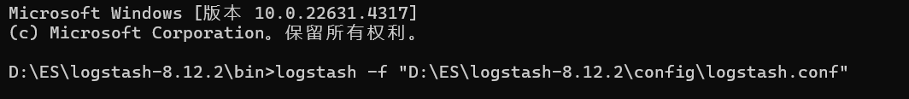

**学院：省级示范性软件学院**

**课程：高级数据库技术与应用**

**题目：** 《 实验四：Logstash操作》

**姓名：** 陆金淼

**学号：** 2200770279

**班级：** 软工2203

**日期：** 2024-10-28

**实验环境：** Elasticsearch8.12.2 Kibana8.12.2 Logstashl8.12.2

## 一、**实验目的**

1.掌握Logstash的基本操作和配置。

2.学习如何将Tomcat日志导入到Elasticsearch中，并创建相应的索引。

3.学习如何在Elasticsearch中进行日志相关的数据分析。

4.掌握如何将MySQL数据库中的数据导入到Elasticsearch中。

5.学习如何实现数据库表更新后数据的自动同步到Elasticsearch。

## 二、**实验内容**

### 2.1. **tomcat日志处理**

**要求：**

1. **将tomcat的logs中的localhost\_access\_log访问日志导入到本地的elasticsearch中。**
2. **数据导入到一个名为tomcat\_logs的索引。**
3. **在elasticsearch中做5个日志相关的分析，题目自拟。（提示：可以参考第04章聚合操作日志实战内容）**

1.将已经给定的文件解压后，在`logstash-8.12.2/config`目录下创建一个logstash.conf的文件，并配置文件内容

```
input {
  file {
    path => "D:/ES/tomcat_logs/localhost_access_log.*.txt"  # 日志文件的路径，使用通配符匹配所有相关文件
    start_position => "beginning" 
    sincedb_path => "D:/ES/sincedb.sql"  # 不记录读取位置，方便反复测试
    codec => "plain"  # 指定文件的编码方式
  }
}

filter {
  grok {
    match => { "message" => "%{IP:client} - - \[%{HTTPDATE:timestamp}\] \"%{WORD:method} %{URIPATH:request} HTTP/%{NUMBER:http_version}\" %{NUMBER:response} (?:%{NUMBER:bytes}|-)" }
  }
  date {
    match => ["timestamp", "dd/MMM/yyyy:HH:mm:ss Z"]
    target => "@timestamp"
  }
}
output {
  elasticsearch {
    hosts => ["http://localhost:9200"] 
    index => "tomcat_logs"  
  }
  stdout { codec => rubydebug }  # 输出到控制台，便于调试
}
```

2.在`logstash-8.12.2/bin`目录下打开cmd，输入命令`logstash -f "D:\ES\logstash-8.12.2\config\logstash.conf"`



3.导入成功之后显示如下内容，如果有报错就根据报错来修改配置


4.进入Kibana，完成5个日志相关的分析

①请求情况

示例：查询服务器响应状态码分布。

```
GET /tomcat_logs/_search
{
  "size": 0,
  "aggs": {
    "response_codes": {
      "terms": {
        "field": "response.keyword"
      }
    }
  }
}
```

查询结果：

```
{
  "took": 1,
  "timed_out": false,
  "_shards": {
    "total": 1,
    "successful": 1,
    "skipped": 0,
    "failed": 0
  },
  "hits": {
    "total": {
      "value": 6000,
      "relation": "eq"
    },
    "max_score": null,
    "hits": []
  },
  "aggregations": {
    "response_codes": {
      "doc_count_error_upper_bound": 0,
      "sum_other_doc_count": 0,
      "buckets": [
        {
          "key": "500",
          "doc_count": 781
        },
        {
          "key": "200",
          "doc_count": 749
        },
        {
          "key": "404",
          "doc_count": 738
        },
        {
          "key": "302",
          "doc_count": 732
        }
      ]
    }
  }
}
```

②时间序列分析

示例：查询每天的请求量，以识别流量高峰日。

```
GET /tomcat_logs/_search
{
  "size": 0,
  "aggs": {
    "daily_requests": {
      "date_histogram": {
        "field": "@timestamp",
        "calendar_interval": "day"
      }
    }
  }
}

```

查询结果：

```
{
  "took": 6,
  "timed_out": false,
  "_shards": {
    "total": 1,
    "successful": 1,
    "skipped": 0,
    "failed": 0
  },
  "hits": {
    "total": {
      "value": 6000,
      "relation": "eq"
    },
    "max_score": null,
    "hits": []
  },
  "aggregations": {
    "daily_requests": {
      "buckets": [
        {
          "key_as_string": "2024-08-24T00:00:00.000Z",
          "key": 1724457600000,
          "doc_count": 3
        },
        {
          "key_as_string": "2024-08-25T00:00:00.000Z",
          "key": 1724544000000,
          "doc_count": 11
        },
        {
          "key_as_string": "2024-08-26T00:00:00.000Z",
          "key": 1724630400000,
          "doc_count": 10
        },
        {
          "key_as_string": "2024-08-27T00:00:00.000Z",
          "key": 1724716800000,
          "doc_count": 11
        },
        {
          "key_as_string": "2024-08-28T00:00:00.000Z",
          "key": 1724803200000,
          "doc_count": 18
        },
        {
          "key_as_string": "2024-08-29T00:00:00.000Z",
          "key": 1724889600000,
          "doc_count": 16
        },
        {
          "key_as_string": "2024-08-30T00:00:00.000Z",
          "key": 1724976000000,
          "doc_count": 27
        },
        {
          "key_as_string": "2024-08-31T00:00:00.000Z",
          "key": 1725062400000,
          "doc_count": 30
        },
        {
          "key_as_string": "2024-09-01T00:00:00.000Z",
          "key": 1725148800000,
          "doc_count": 27
        },
        {
          "key_as_string": "2024-09-02T00:00:00.000Z",
          "key": 1725235200000,
          "doc_count": 42
        },
        {
          "key_as_string": "2024-09-03T00:00:00.000Z",
          "key": 1725321600000,
          "doc_count": 41
        },
        {
          "key_as_string": "2024-09-04T00:00:00.000Z",
          "key": 1725408000000,
          "doc_count": 51
        },
        {
          "key_as_string": "2024-09-05T00:00:00.000Z",
          "key": 1725494400000,
          "doc_count": 54
        },
        {
          "key_as_string": "2024-09-06T00:00:00.000Z",
          "key": 1725580800000,
          "doc_count": 49
        },
        {
          "key_as_string": "2024-09-07T00:00:00.000Z",
          "key": 1725667200000,
          "doc_count": 43
        },
        {
          "key_as_string": "2024-09-08T00:00:00.000Z",
          "key": 1725753600000,
          "doc_count": 54
        },
        {
          "key_as_string": "2024-09-09T00:00:00.000Z",
          "key": 1725840000000,
          "doc_count": 44
        },
        {
          "key_as_string": "2024-09-10T00:00:00.000Z",
          "key": 1725926400000,
          "doc_count": 64
        },
        {
          "key_as_string": "2024-09-11T00:00:00.000Z",
          "key": 1726012800000,
          "doc_count": 61
        },
        {
          "key_as_string": "2024-09-12T00:00:00.000Z",
          "key": 1726099200000,
          "doc_count": 76
        },
        {
          "key_as_string": "2024-09-13T00:00:00.000Z",
          "key": 1726185600000,
          "doc_count": 78
        },
        {
          "key_as_string": "2024-09-14T00:00:00.000Z",
          "key": 1726272000000,
          "doc_count": 68
        },
        {
          "key_as_string": "2024-09-15T00:00:00.000Z",
          "key": 1726358400000,
          "doc_count": 64
        },
        {
          "key_as_string": "2024-09-16T00:00:00.000Z",
          "key": 1726444800000,
          "doc_count": 83
        },
        {
          "key_as_string": "2024-09-17T00:00:00.000Z",
          "key": 1726531200000,
          "doc_count": 94
        },
        {
          "key_as_string": "2024-09-18T00:00:00.000Z",
          "key": 1726617600000,
          "doc_count": 83
        },
        {
          "key_as_string": "2024-09-19T00:00:00.000Z",
          "key": 1726704000000,
          "doc_count": 95
        },
        {
          "key_as_string": "2024-09-20T00:00:00.000Z",
          "key": 1726790400000,
          "doc_count": 102
        },
        {
          "key_as_string": "2024-09-21T00:00:00.000Z",
          "key": 1726876800000,
          "doc_count": 76
        },
        {
          "key_as_string": "2024-09-22T00:00:00.000Z",
          "key": 1726963200000,
          "doc_count": 83
        },
        {
          "key_as_string": "2024-09-23T00:00:00.000Z",
          "key": 1727049600000,
          "doc_count": 85
        },
        {
          "key_as_string": "2024-09-24T00:00:00.000Z",
          "key": 1727136000000,
          "doc_count": 90
        },
        {
          "key_as_string": "2024-09-25T00:00:00.000Z",
          "key": 1727222400000,
          "doc_count": 84
        },
        {
          "key_as_string": "2024-09-26T00:00:00.000Z",
          "key": 1727308800000,
          "doc_count": 101
        },
        {
          "key_as_string": "2024-09-27T00:00:00.000Z",
          "key": 1727395200000,
          "doc_count": 99
        },
        {
          "key_as_string": "2024-09-28T00:00:00.000Z",
          "key": 1727481600000,
          "doc_count": 76
        },
        {
          "key_as_string": "2024-09-29T00:00:00.000Z",
          "key": 1727568000000,
          "doc_count": 89
        },
        {
          "key_as_string": "2024-09-30T00:00:00.000Z",
          "key": 1727654400000,
          "doc_count": 67
        },
        {
          "key_as_string": "2024-10-01T00:00:00.000Z",
          "key": 1727740800000,
          "doc_count": 71
        },
        {
          "key_as_string": "2024-10-02T00:00:00.000Z",
          "key": 1727827200000,
          "doc_count": 67
        },
        {
          "key_as_string": "2024-10-03T00:00:00.000Z",
          "key": 1727913600000,
          "doc_count": 64
        },
        {
          "key_as_string": "2024-10-04T00:00:00.000Z",
          "key": 1728000000000,
          "doc_count": 58
        },
        {
          "key_as_string": "2024-10-05T00:00:00.000Z",
          "key": 1728086400000,
          "doc_count": 57
        },
        {
          "key_as_string": "2024-10-06T00:00:00.000Z",
          "key": 1728172800000,
          "doc_count": 59
        },
        {
          "key_as_string": "2024-10-07T00:00:00.000Z",
          "key": 1728259200000,
          "doc_count": 46
        },
        {
          "key_as_string": "2024-10-08T00:00:00.000Z",
          "key": 1728345600000,
          "doc_count": 46
        },
        {
          "key_as_string": "2024-10-09T00:00:00.000Z",
          "key": 1728432000000,
          "doc_count": 41
        },
        {
          "key_as_string": "2024-10-10T00:00:00.000Z",
          "key": 1728518400000,
          "doc_count": 22
        },
        {
          "key_as_string": "2024-10-11T00:00:00.000Z",
          "key": 1728604800000,
          "doc_count": 39
        },
        {
          "key_as_string": "2024-10-12T00:00:00.000Z",
          "key": 1728691200000,
          "doc_count": 34
        },
        {
          "key_as_string": "2024-10-13T00:00:00.000Z",
          "key": 1728777600000,
          "doc_count": 22
        },
        {
          "key_as_string": "2024-10-14T00:00:00.000Z",
          "key": 1728864000000,
          "doc_count": 26
        },
        {
          "key_as_string": "2024-10-15T00:00:00.000Z",
          "key": 1728950400000,
          "doc_count": 24
        },
        {
          "key_as_string": "2024-10-16T00:00:00.000Z",
          "key": 1729036800000,
          "doc_count": 23
        },
        {
          "key_as_string": "2024-10-17T00:00:00.000Z",
          "key": 1729123200000,
          "doc_count": 18
        },
        {
          "key_as_string": "2024-10-18T00:00:00.000Z",
          "key": 1729209600000,
          "doc_count": 12
        },
        {
          "key_as_string": "2024-10-19T00:00:00.000Z",
          "key": 1729296000000,
          "doc_count": 11
        },
        {
          "key_as_string": "2024-10-20T00:00:00.000Z",
          "key": 1729382400000,
          "doc_count": 7
        },
        {
          "key_as_string": "2024-10-21T00:00:00.000Z",
          "key": 1729468800000,
          "doc_count": 4
        },
        {
          "key_as_string": "2024-10-22T00:00:00.000Z",
          "key": 1729555200000,
          "doc_count": 0
        },
        {
          "key_as_string": "2024-10-23T00:00:00.000Z",
          "key": 1729641600000,
          "doc_count": 0
        },
        {
          "key_as_string": "2024-10-24T00:00:00.000Z",
          "key": 1729728000000,
          "doc_count": 0
        },
        {
          "key_as_string": "2024-10-25T00:00:00.000Z",
          "key": 1729814400000,
          "doc_count": 0
        },
        {
          "key_as_string": "2024-10-26T00:00:00.000Z",
          "key": 1729900800000,
          "doc_count": 0
        },
        {
          "key_as_string": "2024-10-27T00:00:00.000Z",
          "key": 1729987200000,
          "doc_count": 0
        },
        {
          "key_as_string": "2024-10-28T00:00:00.000Z",
          "key": 1730073600000,
          "doc_count": 3000
        }
      ]
    }
  }
}
```

③错误分析

示例：查询前10个导致错误状态码（如4xx和5xx）。

```
GET /tomcat_logs/_search
{
  "size": 0,
  "query": {
    "range": {
      "response": {
        "gte": 400,
        "lte": 599
      }
    }
  },
  "aggs": {
    "error_paths": {
      "terms": {
        "field": "request.keyword",
        "size": 10
      }
    }
  }
}
```

查询结果：

```
{
  "took": 4,
  "timed_out": false,
  "_shards": {
    "total": 1,
    "successful": 1,
    "skipped": 0,
    "failed": 0
  },
  "hits": {
    "total": {
      "value": 1519,
      "relation": "eq"
    },
    "max_score": null,
    "hits": []
  },
  "aggregations": {
    "error_paths": {
      "doc_count_error_upper_bound": 0,
      "sum_other_doc_count": 831,
      "buckets": [
        {
          "key": "/static/js/app.js",
          "doc_count": 83
        },
        {
          "key": "/demo1/",
          "doc_count": 74
        },
        {
          "key": "/blog/post/2",
          "doc_count": 73
        },
        {
          "key": "/examples/jsp/images/execute.gif",
          "doc_count": 73
        },
        {
          "key": "/demo/",
          "doc_count": 65
        },
        {
          "key": "/demo/hello",
          "doc_count": 65
        },
        {
          "key": "/static/images/logo.png",
          "doc_count": 65
        },
        {
          "key": "/about",
          "doc_count": 64
        },
        {
          "key": "/blog/post/1",
          "doc_count": 63
        },
        {
          "key": "/contact",
          "doc_count": 63
        }
      ]
    }
  }
}
```

④请求失败原因分析

示例：查询请求失败原因。

```
GET /tomcat_logs/_search
{
  "size": 0,
  "aggs": {
    "error_reasons": {
      "terms": {
        "field": "message.keyword"
      }
    }
  },
  "query": {
    "range": {
      "response": {
        "gte": 400
      }
    }
  }
}
```

查询结果：

```
{
  "took": 9,
  "timed_out": false,
  "_shards": {
    "total": 1,
    "successful": 1,
    "skipped": 0,
    "failed": 0
  },
  "hits": {
    "total": {
      "value": 1519,
      "relation": "eq"
    },
    "max_score": null,
    "hits": []
  },
  "aggregations": {
    "error_reasons": {
      "doc_count_error_upper_bound": 0,
      "sum_other_doc_count": 1496,
      "buckets": [
        {
          "key": """0:0:0:0:0:0:0:1 - - [27/Sep/2024:11:12:31 +0800] "GET /examples/jsp/images/execute.gif HTTP/1.1" 500 13
""",
          "doc_count": 3
        },
        {
          "key": """0:0:0:0:0:0:0:1 - - [29/Sep/2024:11:12:31 +0800] "POST /demo HTTP/1.1" 404 99
""",
          "doc_count": 3
        },
        {
          "key": """0:0:0:0:0:0:0:1 - - [31/Aug/2024:11:12:31 +0800] "POST /examples/jsp/images/return.gif HTTP/1.1" 404 99
""",
          "doc_count": 3
        },
        {
          "key": """0:0:0:0:0:0:0:1 - - [01/Oct/2024:11:12:31 +0800] "GET /products/item/123 HTTP/1.1" 404 1242
""",
          "doc_count": 2
        },
        {
          "key": """0:0:0:0:0:0:0:1 - - [01/Oct/2024:11:12:31 +0800] "GET /products/item/456 HTTP/1.1" 500 13
""",
          "doc_count": 2
        },
        {
          "key": """0:0:0:0:0:0:0:1 - - [01/Oct/2024:11:12:31 +0800] "GET /static/js/app.js HTTP/1.1" 500 292
""",
          "doc_count": 2
        },
        {
          "key": """0:0:0:0:0:0:0:1 - - [05/Oct/2024:11:12:31 +0800] "POST /api/user/settings HTTP/1.1" 500 13
""",
          "doc_count": 2
        },
        {
          "key": """0:0:0:0:0:0:0:1 - - [06/Oct/2024:11:12:31 +0800] "GET /api/data HTTP/1.1" 500 14
""",
          "doc_count": 2
        },
        {
          "key": """0:0:0:0:0:0:0:1 - - [07/Sep/2024:11:12:31 +0800] "GET /examples/jsp/images/code.gif HTTP/1.1" 404 99
""",
          "doc_count": 2
        },
        {
          "key": """0:0:0:0:0:0:0:1 - - [10/Oct/2024:11:12:31 +0800] "POST /demo/hello HTTP/1.1" 404 292
""",
          "doc_count": 2
        }
      ]
    }
  }
}
```

⑤客户端IP地址分析

示例：查询客户端IP地址。

```
GET /tomcat_logs/_search
{
  "size": 0,
  "aggs": {
    "client_ips": {
      "terms": {
        "field": "client.keyword"
      }
    }
  }
}
```

查询结果：

```
{
  "took": 0,
  "timed_out": false,
  "_shards": {
    "total": 1,
    "successful": 1,
    "skipped": 0,
    "failed": 0
  },
  "hits": {
    "total": {
      "value": 6000,
      "relation": "eq"
    },
    "max_score": null,
    "hits": []
  },
  "aggregations": {
    "client_ips": {
      "doc_count_error_upper_bound": 0,
      "sum_other_doc_count": 0,
      "buckets": [
        {
          "key": "0:0:0:0:0:0:0:1",
          "doc_count": 3000
        }
      ]
    }
  }
}
```

### 2.2. **数据转换和传输**

**要求：**

1. **将本地的mysql数据库中的一张表导入到本地的elasticsearch中。**
2. **数据库表更新后，数据能够自动同步到elasticsearch中。**

1.下载jdbc驱动，将其驱动放在`logstash-8.12.2/jars`目录下。


2.在`logstash-8.12.2/config`目录下创建一个mysql_to_es.conf文件，并配置以下内容

```
input {
  jdbc {
    jdbc_driver_library => "D:\ES\logstash-8.12.2\jars\mysql-connector-j-9.1.0.jar"
    jdbc_driver_class => "com.mysql.cj.jdbc.Driver"
    jdbc_connection_string => "jdbc:mysql://localhost:3306/jdbc_demo"
    jdbc_user => "root"
    jdbc_password => "ljm14785846159"
    statement => "SELECT * FROM student"
    schedule => "*/5 * * * * *" # 每5秒运行一次
  }
}

output {
  elasticsearch {
    hosts => ["http://localhost:9200"]
    index => "students"
    document_id => "%{id}" # 假设 student 表有一个id 字段作为主键
  }
  stdout { codec => json_lines }
}


```

此时我的students表中数据如下


3.运行命令，进入在`logstash-8.12.2/bin`目录下打开cmd，输入命令`logstash -f "D:\ES\logstash-8.12.2\config\mysql_to_es.conf"`


4.查询是否导入成功

```
GET /students/_search
{
  "query": {
    "match_all": {}
  }
}
```

查询结果：

```
{
  "took": 847,
  "timed_out": false,
  "_shards": {
    "total": 1,
    "successful": 1,
    "skipped": 0,
    "failed": 0
  },
  "hits": {
    "total": {
      "value": 6,
      "relation": "eq"
    },
    "max_score": 1,
    "hits": [
      {
        "_index": "students",
        "_id": "%{student_id}",
        "_score": 1,
        "_source": {
          "age": 19,
          "name": "陆玲儿",
          "id": 4,
          "@timestamp": "2024-10-28T09:48:20.091475100Z",
          "gender": "女",
          "@version": "1"
        }
      },
      {
        "_index": "students",
        "_id": "2",
        "_score": 1,
        "_source": {
          "age": 99,
          "gender": "女",
          "@timestamp": "2024-10-28T09:53:55.885501900Z",
          "name": "宝儿姐",
          "id": 2,
          "@version": "1"
        }
      },
      {
        "_index": "students",
        "_id": "1",
        "_score": 1,
        "_source": {
          "age": 18,
          "gender": "男",
          "@timestamp": "2024-10-28T09:53:55.885501900Z",
          "name": "张楚岚",
          "id": 1,
          "@version": "1"
        }
      },
      {
        "_index": "students",
        "_id": "4",
        "_score": 1,
        "_source": {
          "age": 19,
          "gender": "女",
          "@timestamp": "2024-10-28T09:53:55.887004200Z",
          "name": "陆玲儿",
          "id": 4,
          "@version": "1"
        }
      },
      {
        "_index": "students",
        "_id": "5",
        "_score": 1,
        "_source": {
          "age": 22,
          "gender": "男",
          "@timestamp": "2024-10-28T09:53:55.887004200Z",
          "name": "诸葛清",
          "id": 5,
          "@version": "1"
        }
      },
      {
        "_index": "students",
        "_id": "3",
        "_score": 1,
        "_source": {
          "age": 21,
          "gender": "男",
          "@timestamp": "2024-10-28T09:53:55.885501900Z",
          "name": "王也",
          "id": 3,
          "@version": "1"
        }
      }
    ]
  }
}
```

5.在students表中添加一条数据，查看是否同步更新

插入数据如下：


查询是否插入成功：


可以看到已经插入成功。

## 三、**问题及解决办法**

1.Logstash配置文件语法错误

解决方法： 仔细检查配置文件的语法，确保所有的插件和参数都正确无误。

2.数据格式不匹配

解决方法： 检查数据格式，并根据需要调整Logstash的过滤器或Elasticsearch的索引映射。
