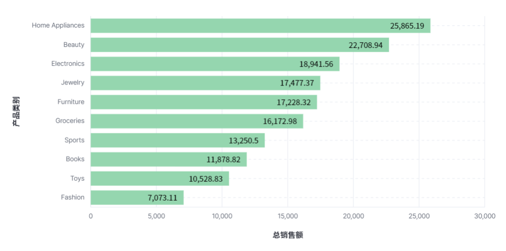

**学院：省级示范性软件学院**

**课程：高级数据库技术与应用**

**题目：** 《 实验五：Kibana操作》

**姓名：** 陆金淼

**学号：** 2200770279

**班级：** 软工2203

**日期：** 2024-11-8

**实验环境：** Elasticsearch8.12.2 Kibana8.12.2

## 一、**实验目的**

1.数据分析能力：通过解决具体的数据分析问题，提高对数据的理解和分析能力。

2.实际操作技能：通过完成具体的实验题目，提升使用Kibana和Elasticsearch进行数据操作的技能。

3.仪表盘制作：学习如何将聚合结果可视化，制作信息丰富的仪表盘，以便更好地展示和理解数据。

## 二、**实验内容**

**要求：**

1. **使用Kibana可视化图表完成**[实验三 聚合操作](https://www.yuque.com/u369937/wskurb/nizzczly3ahu08t9 "实验三 聚合操作")的 10道题
2. **将做好的10个可视化放到1个或2个仪表盘中**
3. **仪表盘中增加一些控件，文字描述，筛选等**

### 1.选择以下十个题进行可视化。

（1）统计每个产品类别的总销售额。

（2）计算每个城市的平均订单金额。

（3）找出销量最高的前5个产品。

（4）统计每种支付方式的使用次数和总金额。

（5）计算男性和女性客户的平均年龄。

（6）计算每月的总销售额。

（7）找出平均订单金额最高的前3个客户。

（8）**统计每个产品类别中的商品数量**。

（9）计算每个产品类别的平均单价。

（10）**计算男性和女性客户的平均订单金额**。

### 2.制作仪表盘

仪表盘链接

[http://localhost:5601/app/r/s/DJm4x](https://)

## 三、**问题及解决办法**

1.问题：结果可视化困难，将聚合结果转化为直观的可视化图表可能存在挑战

解决办法：利用Kibana的可视化工具，如柱状图、折线图等，根据数据特点选择合适的图表类型进行展示。
